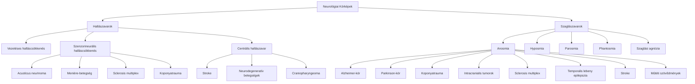

#részvizsga #neuroanat #hallás #szaglás

# Részletes
**Bevezetés** A hallás és a szaglás érzékelése alapvető fontosságú az ember számára a környezettel való interakcióban, a kommunikációban és a veszélyek felismerésében. Ezen érzékszervek működésének zavarai jelentősen ronthatják az életminőséget, és gyakran fontos diagnosztikai jelként szolgálhatnak különböző neurológiai kórképek esetében. A károsodás érintheti a perifériás receptorokat, az idegpályákat vagy a központi feldolgozó agyi területeket.  

**Hallászavarok Neurológiai Kórképekben** A hallászavarokat alapvetően három fő típusba sorolhatjuk:

- **Vezetéses (konduktív) halláscsökkenés:** A hanghullámok fizikai továbbításának akadálya a külsőfülben (pl. fülzsírdugó, külső hallójárat gyulladása) vagy a középfülben (pl. dobhártya perforáció, középfülgyulladás, a hallócsontlánc megszakadása vagy fixációja, Eustach-kürt diszfunkció). Neurológiai kórképek ritkán okoznak primer vezetéses halláscsökkenést, bár a nervus facialis bénulása a musculus stapedius kiesése révén befolyásolhatja a középfül hangátviteli mechanizmusát (hyperacusist okozva), ami nem klasszikus vezetéses halláscsökkenés, de a hangfeldolgozás zavara.  
    
- **Szenzorineurális (perceptiós vagy idegi) halláscsökkenés:** A belső fül (csiga, szőrsejtek) vagy a hallóideg (nervus cochlearis, a VIII. agyideg része) károsodása okozza. Ez a típus gyakran társul neurológiai betegségekhez.  
    
- **Centrális hallászavar:** A hallópályák agytörzsi (nuclei cochleares, oliva superior komplex, lemniscus lateralis, colliculus inferior), thalamikus (corpus geniculatum mediale) vagy kérgi (primer és másodlagos hallókéreg a temporalis lebenyben) szakaszainak károsodása esetén jön létre. Mivel a hallópályák jelentős mértékben kereszteződnek és bilaterálisan reprezentáltak az agytörzstől felfelé, egyoldali centrális lézió ritkán okoz teljes süketséget vagy súlyos hallásvesztést az ellenoldali fülön. Gyakrabban a hangok feldolgozásának, a beszédértésnek (különösen zajos környezetben), a hanglokalizációnak vagy a komplex hangmintázatok felismerésének zavara jellemző.  
    

**Hallászavart okozó specifikus neurológiai kórképek:**

- **Agytörzsi léziók:** Tumorok (pl. gliomák, metasztázisok), stroke-ok (különösen a vertebrobasilaris rendszer érkatasztrófái), gyulladásos folyamatok (pl. encephalitis) vagy demyelinisatiós betegségek (pl. sclerosis multiplex) érinthetik a cochlearis magvakat vagy a felszálló hallópályákat (pl. lemniscus lateralis). Kétoldali, kiterjedt agytörzsi lézió súlyos halláscsökkenést vagy akár kérgi süketséget is okozhat.  
    
- **Acusticus neurinoma (Vestibularis Schwannoma):** Ez egy jóindulatú daganat, amely a nervus vestibulocochlearis (VIII. agyideg) Schwann-sejtjeiből indul ki, leggyakrabban a vestibularis komponensből, a cerebellopontin szögletben. Korai és jellemző tünetei az egyoldali, lassan progrediáló szenzorineurális halláscsökkenés, a fülzúgás (tinnitus) és a bizonytalanságérzés vagy vertigo. A növekvő tumor nyomhatja a környező agyidegeket (V., VII.) és a kisagyat is, további tüneteket okozva.  
    
- **Sclerosis multiplex (SM):** Ez a központi idegrendszer krónikus, gyulladásos, demyelinisatiós autoimmun betegsége. A demyelinisatiós plakkok érinthetik a hallóideget az agytörzsi belépésénél, az agytörzsi hallópályákat vagy ritkábban a hallókérget. Bár a súlyos, tartós hallásvesztés nem tipikus SM-ben, előfordulhat hirtelen kialakuló vagy fluktuáló halláscsökkenés, fülzúgás, vagy a hangfeldolgozás finomabb zavarai. A vestibularis rendszer gyakori érintettsége miatt szédülés és nystagmus is társulhat.  
    
- **Stroke:** Különösen a hátsó keringési rendszer (vertebrobasilaris rendszer) vérellátási zavarai okozhatnak hallászavarokat. Az arteria cerebelli inferior anterior (AICA) elzáródása például a lateralis pontomedullaris szindróma részeként hirtelen kialakuló hallásvesztést, fülzúgást és vertigót okozhat a belső fül és/vagy az agytörzsi hallómagvak ischaemiája miatt. A temporalis lebenyt érintő stroke károsíthatja a primer vagy másodlagos hallókérget, ami a hangok felismerésének vagy a beszédértésnek a zavarát (auditoros agnózia, Wernicke-afázia) eredményezheti.  
    
- **Meniére-betegség:** Ismeretlen etiológiájú kórkép, amelyet a belső fül folyadéktereinek (endolympha) nyomásfokozódása (endolymphaticus hydrops) jellemez. Rohamokban jelentkező tünetei: heves, forgó jellegű vertigo (többnyire 20 perctől néhány óráig tart), fluktuáló, kezdetben főleg a mély hangokat érintő, majd progrediáló szenzorineurális halláscsökkenés, fülzúgás és fül teltségérzés az érintett oldalon.  
    
- **Koponyatrauma:** A sziklacsont (os temporale) törései közvetlenül károsíthatják a közép- vagy belső fül struktúráit (pl. hallócsontlánc luxációja, a csiga vagy a hallóideg sérülése), ami vezetéses vagy szenzorineurális halláscsökkenést eredményezhet. Az agyrázkódás vagy agyzúzódás is okozhat átmeneti vagy tartós hallászavarokat, fülzúgást.  
    
- **Neurodegeneratív betegségek:** Bár ritkábban, de egyes neurodegeneratív kórképek (pl. bizonyos spinocerebellaris ataxiák, Friedrich-ataxia) érinthetik a centrális hallórendszert, ami progresszív halláscsökkenéshez vagy a beszédértés romlásához vezethet.
- **Craniopharyngeoma:** Ez egy ritka, jóindulatú, de lokálisan invazív agydaganat, amely a hypophysisnyél vagy a Rathke-tasak maradványaiból indul ki. Ha a daganat méreténél vagy elhelyezkedésénél fogva a hátulsó garatüreget vagy a koponyaalap más, hallással kapcsolatos struktúráit (pl. Eustach-kürtöt, idegeket) komprimálja vagy infiltrálja, másodlagosan hallászavart, füldugulást, fülzúgást okozhat.  
    

A hallászavarok neurológiai kórképekben gyakran nem izolált tünetként, hanem egy komplexebb szindróma részeként jelennek meg. Ez arra utal, hogy a hallópályák vagy az azokat ellátó erek és a környező idegstruktúrák közelsége miatt a károsodás ritkán szelektív. Az izolált centrális hallászavar ritka, ami a hallópályák jelentős bilateralitására és redundanciájára utal az agytörzsben és a kéregben.

**Szaglászavarok Neurológiai Kórképekben** A szaglás zavarai (dysosmia) szintén fontos neurológiai tünetek lehetnek.

- **Típusai:**  
    
    - **Anosmia:** A szaglás teljes elvesztése.
    - **Hyposmia:** Csökkent szaglóképesség, a szagok intenzitásának gyengébb érzékelése.
    - **Parosmia (cacosmia, ha kellemetlen):** Torz szagérzékelés; egy ismert szagingerre a beteg más, gyakran kellemetlen szagot érez.
    - **Phantosmia:** Szaghallucináció; szaginger jelenléte nélkül is szagot érez a beteg, ez is gyakran kellemetlen (pl. égett, rothadt szag).
    - **Szaglási agnózia (olfactorius agnosia):** A szagérzékelés képessége megtartott, de a beteg nem képes felismerni, azonosítani vagy megnevezni az érzékelt szagokat.
- **Szaglászavart okozó specifikus neurológiai kórképek:**
    - **Neurodegeneratív betegségek:**
        - **Alzheimer-kór:** A szaglászavar (jellemzően hyposmia vagy anosmia) az egyik legkorábbi, gyakran a kognitív hanyatlást megelőző tünet lehet. A patológiai folyamat (pl. amyloid plakkok, neurofibrilláris kötegek) érinti a szaglóhámot, a bulbus olfactoriust, valamint a centrális szaglópályákat és -kérget (pl. entorhinalis kéreg, hippocampus, amygdala). A szaglásvizsgálat potenciális non-invazív, korai diagnosztikai marker lehet ebben a kórképben.  
            
        - **Parkinson-kór:** A hyposmia szintén nagyon gyakori (a betegek több mint 90%-át érinti) és korai nem-motoros tünet, amely évekkel megelőzheti a klasszikus motoros tünetek (tremor, rigiditás, bradykinesia) megjelenését. Lewy-testek (alfa-szinuklein aggregátumok) mutathatók ki a szaglóhagymában és más szaglórendszeri struktúrákban.  
            
    - **Koponyatrauma:** Az egyik leggyakoribb oka a szerzett, tartós anosmiának vagy hyposmiának. A sérülés mechanizmusa lehet a szaglóideg finom rostjainak (fila olfactoria) elszakadása, amint azok áthaladnak a lamina cribrosa (rostalemez) apró nyílásain (különösen frontális vagy occipitalis ütéseknél, az ún. "coup-contrecoup" mechanizmus révén), a szaglóhagyma (bulbus olfactorius) zúzódása vagy bevérzése, illetve a frontalis lebeny (orbitofrontalis kéreg, amely a másodlagos szaglókéreg része) sérülése. A szaglásvesztés mértéke és a javulás esélye a sérülés súlyosságától és lokalizációjától függ.  
        
    - **Intracranialis tumorok:** Különösen az elülső koponyagödörben (frontobasalis régióban) elhelyezkedő daganatok, mint például a szaglóbarázda meningeomája (meningioma sulci olfactorii), az olfactorius neuroblastoma (esthesioneuroblastoma), vagy a hypophysis nagy, suprasellarisan terjedő tumorai nyomhatják vagy infiltrálhatják a szaglóhagymát, a tractus olfactoriust vagy a primer szaglókérget, anosmiát vagy hyposmiát okozva.  
        
    - **Sclerosis multiplex (SM):** Esetenként a demyelinisatiós plakkok érinthetik a centrális szaglópályákat, ami szaglászavarhoz vezethet, bár ez nem tartozik a leggyakoribb SM tünetek közé.  
        
    - **Temporalis lebeny epilepszia:** A roham bevezető tüneteként (aura) jelentkezhet szaglási hallucináció (phantosmia), amely gyakran kellemetlen (pl. égett gumi, kénes) szag érzetével jár. Ezt az uncus gyri parahippocampalis (a primer szaglókéreg része) vagy az amygdala kóros elektromos aktivitása, irritációja okozza.  
        
    - **Stroke:** Ritkán, de az orbitofrontalis vagy temporalis lebeny szaglókéregi területeit ellátó artériák elzáródása (pl. arteria cerebri anterior vagy media ágainak stroke-ja) okozhat szaglászavart.
    - **Műtéti szövődmények:** Bizonyos neurokirurgiai beavatkozások, amelyek az elülső koponyaalapot vagy a frontalis/temporalis lebenyeket érintik, iatrogén módon károsíthatják a szaglórendszer struktúráit.  
        

A szaglászavarok, különösen a hyposmia, gyakran és korán jelentkeznek olyan neurodegeneratív betegségekben, mint az Alzheimer- és Parkinson-kór. Ez arra utal, hogy a szaglórendszer különösen érzékeny lehet ezen betegségek korai patológiai folyamataira.

**Táblázat 4: Hallás- és Szaglászavarok Gyakori Neurológiai Okai**

| Érzékszervi Zavar                    | Definíció/Jellemzők                                                                                                        | Tipikus Neurológiai Kórképek/Okok                                                                                        | Feltételezett Mechanizmus                                                                                         |
| :----------------------------------- | :------------------------------------------------------------------------------------------------------------------------- | :----------------------------------------------------------------------------------------------------------------------- | :---------------------------------------------------------------------------------------------------------------- |
| **Szenzorineurális halláscsökkenés** | Belső fül vagy hallóideg károsodása; hangok érzékelésének és/vagy megkülönböztetésének nehézsége.                          | Acusticus neurinoma, Meniére-betegség, agytörzsi stroke (pl. AICA), SM, koponyatrauma (sziklacsonttörés), labyrinthitis. | Szőrsejtek pusztulása, hallóideg demyelinisatiója/kompressziója/ischaemiája, belső fül folyadékháztartási zavara. |
| **Centrális hallászavar**            | Hallópályák (agytörzs, thalamus) vagy hallókéreg károsodása; gyakran beszédértési nehézség zajban, hanglokalizációs zavar. | Agytörzsi/thalamikus stroke, tumor, SM, temporalis lebeny léziói.                                                        | Hallási információ feldolgozásának, integrációjának, átkapcsolásának zavara a centrális pályákon vagy a kéregben. |
|   
**Anosmia/Hyposmia**             | Teljes/részleges sz                                                                                                        |                                                                                                                          |                                                                                                                   |

# Összefoglalás

## 🧠 Hallás- és Szaglászavarok Neurológiai Kórképekben

### 🎧 Hallászavarok típusai

- **Vezetéses halláscsökkenés**: A hanghullámok fizikai továbbításának akadálya a külső vagy középfülben (pl. fülzsírdugó, dobhártya perforáció).
    
- **Szenzorineurális halláscsökkenés**: A belső fül vagy a hallóideg károsodása okozza (pl. acusticus neurinoma, Menière-betegség).
    
- **Centrális hallászavar**: A hallópályák vagy a hallókéreg károsodása esetén jön létre (pl. stroke, sclerosis multiplex).
    

### 🧠 Hallászavart okozó neurológiai kórképek

- **Agytörzsi léziók**: Tumorok, stroke-ok vagy gyulladásos folyamatok érinthetik a hallópályákat.
    
- **Acusticus neurinoma**: Jóindulatú daganat a VIII. agyidegen, jellemző tünetei az egyoldali halláscsökkenés és fülzúgás.
    
- **Sclerosis multiplex**: A demyelinisatiós plakkok érinthetik a hallóideget vagy a hallópályákat.
    
- **Stroke**: Különösen a vertebrobasilaris rendszer érkatasztrófái okozhatnak hallászavarokat.
    
- **Menière-betegség**: Endolymphás nyomásfokozódás a belső fülben, rohamokban jelentkező vertigóval és halláscsökkenéssel.
    
- **Koponyatrauma**: A sziklacsont törései károsíthatják a hallószerveket.
    
- **Neurodegeneratív betegségek**: Bizonyos ataxiák érinthetik a centrális hallórendszert.
    
- **Craniopharyngeoma**: Ritka, jóindulatú daganat, mely komprimálhatja a hallással kapcsolatos struktúrákat.
    

### 👃 Szaglászavarok típusai

- **Anosmia**: A szaglás teljes elvesztése.
    
- **Hyposmia**: Csökkent szaglóképesség.
    
- **Parosmia**: Torz szagérzékelés.
    
- **Phantosmia**: Szaghallucináció.
    
- **Szaglási agnózia**: A szagérzékelés megtartott, de a beteg nem képes felismerni az érzékelt szagokat.
    

### 🧠 Szaglászavart okozó neurológiai kórképek

- **Alzheimer-kór**: A szaglászavar gyakran a kognitív hanyatlást megelőző tünet.
    
- **Parkinson-kór**: A hyposmia nagyon gyakori és korai nem-motoros tünet.
    
- **Koponyatrauma**: A szaglóideg rostjainak elszakadása vagy a szaglóhagyma sérülése okozhat szaglászavart.
    
- **Intracranialis tumorok**: Az elülső koponyagödörben elhelyezkedő daganatok nyomhatják a szaglóhagymát vagy a szaglókérget.
    
- **Sclerosis multiplex**: A demyelinisatiós plakkok érinthetik a centrális szaglópályákat.
    
- **Temporalis lebeny epilepszia**: A roham bevezető tüneteként jelentkezhet szaglási hallucináció.
    
- **Stroke**: Az orbitofrontalis vagy temporalis lebeny szaglókéregi területeit ellátó artériák elzáródása okozhat szaglászavart.
    
- **Műtéti szövődmények**: Bizonyos neurokirurgiai beavatkozások károsíthatják a szaglórendszer struktúráit.

---

## Táblázatos összefoglaló (példák)

|Érzékszervi zavar|Jellemzők|Tipikus okok|Mechanizmus|
|---|---|---|---|
|Szenzorineurális halláscsökkenés|Belső fül/ideg károsodás|Acusticus neurinoma, SM, trauma|Szőrsejt- vagy idegkárosodás|
|Centrális hallászavar|Beszédértés, lokalizáció zavara|Stroke, SM, temporalis lézió|Feldolgozási zavar|
|Anosmia/Hyposmia|Teljes/csökkent szaglás|Alzheimer, Parkinson, trauma|Szaglórendszer degeneráció vagy károsodás|

# Képek
