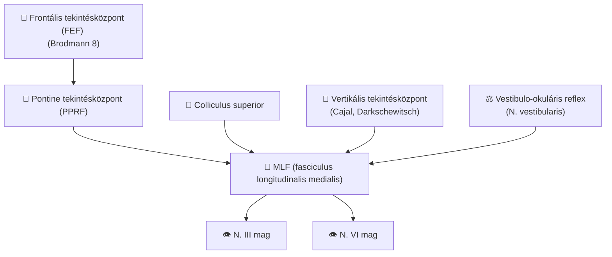

#részvizsga #neuroanat #tekintés 

# Részletes
### 1. A Szemmozgások Supranukleáris Szabályozásának Áttekintése

A szemmozgató agyidegek és az általuk beidegzett izmok csupán a végrehajtó elemei egy sokkal komplexebb rendszernek. A szemmozgások akaratlagos irányítása, koordinációja, a különböző típusú szemmozgások (pl. gyors ugrások, lassú követés, fejmozgást kompenzáló reflexek) közötti váltás, valamint a szemmozgások pontosságának és sebességének finomhangolása mind a supranukleáris kontrollrendszerek feladata. Ezek a rendszerek az agyidegmagok felett helyezkednek el, és magukban foglalják az agykéreg, a bazális ganglionok, a kisagy és az agytörzs bizonyos területeit.  

A supranukleáris kontroll lényegében átalakítja a vizuális és vesztibuláris szenzoros információkat, valamint a belső célokat (pl. mit szeretnénk megnézni) precíz időbeli és térbeli parancsokká az okulomotoros magok számára. Ez a "gondolkodó agy" a szemmozgások mögött, amely lehetővé teszi, hogy tekintetünket tudatosan irányítsuk, adaptáljuk a változó körülményekhez, és hatékonyan használjuk látásunkat a környezet felfedezésére és a feladatok elvégzésére. E magasabb szintű kontroll nélkül a szemmozgások kaotikusak, tisztán reflexszerűek lennének, hiányozna belőlük az akaratlagos irányítás és az adaptációs képesség. A supranukleáris rendszer által szabályozott szemmozgástípusok közé tartoznak a szakkádok (gyors, ugró mozgások), a követő szemmozgások, a fixáció, az akkomodáció, a vestibulo-okuláris reflex (VOR), az optokinetikus reflex (OKR) és a vergencia mozgások.  

**Table 2: A Tekintés Supranukleáris Központjai és Fő Szerepük**

|Központ|Általános Elhelyezkedés|Fő Szerep a Tekintés Kontrollban|Kulcsfontosságú Bemenetek/Kimenetek (röviden)|
|---|---|---|---|
|**Frontális Tekintőmező (FEF)**|Frontális lebeny (Brodmann 8)|Akaratlagos szakkádok, követő mozgások, vizuális figyelem|B: PEF, SEF, látókéreg, SC; K: PPRF, SC, bazális ggl.|
|**Szupplementer Tekintőmező (SEF)**|Frontális lebeny (mediális)|Szemmozgás-szekvenciák, memóriából irányított szakkádok|B: FEF, parietális kéreg; K: FEF, PPRF, SC|
|**Parietális Tekintőmező (PEF/IPS)**|Parietális lebeny (intraparietális sulcus)|Reflexszerű szakkádok, vizuális figyelem, szenzoros-motoros transzformáció|B: látókéreg, FEF; K: SC, FEF|
|**Paramedián Pontin Retikuláris Formáció (PPRF)**|Híd (ventrálisan az MLF-től)|Horizontális konjugált tekintés (szakkádok, követés) generálása|B: FEF, SC, vesztibuláris magok; K: ipszilaterális N. abducens mag|
|**Rosztrális Interszticiális MLF Magja (riMLF)**|Középagy (rostralis)|Vertikális és torzionális szakkádok generálása|B: FEF, SC; K: N. oculomotorius és N. trochlearis magok|
|**Mediális Longitudinális Fasciculus (MLF)**|Agytörzs (hosszanti köteg)|Konjugált szemmozgások koordinációja (különösen horizontális), VOR|B: vesztibuláris magok, N. abducens interneuronok; K: szemmozgató magok|
|**Kisagy: Flocculus/Paraflocculus**|Vestibulocerebellum|VOR adaptáció, követő mozgások, tekintetmegtartás|B: vesztibuláris rendszer, látórendszer; K: vesztibuláris magok|
|**Kisagy: Okulomotoros Vermis/Fastigialis Mag**|Cerebelláris vermis, mély magok|Szakkádok pontossága és adaptációja, követő mozgások|B: kérgi tekintőmezők, agytörzsi központok; K: agytörzsi központok, vesztibuláris magok|
|**Superior Colliculus (SC)**|Középagy (tectum)|Reflexszerű szakkádok, vizuális figyelem, célpontválasztás|B: retina, látókéreg, FEF, PEF; K: PPRF, riMLF, thalamus|
|**Neurális Integrátorok (NPH/MVN, INC)**|Agytörzs (híd/nyúltvelő, középagy)|Sebességparancsok pozícióparancsokká alakítása (tekintetmegtartás)|B: PPRF, riMLF, vesztibuláris rendszer; K: szemmozgató magok|

 

### 2. Kérgi Tekintőközpontok (Cortical Gaze Centers)

`#cortical_eye_fields #FEF #SEF #PEF`

Az agykéreg számos területe vesz részt a szemmozgások komplex szabályozásában, lehetővé téve az akaratlagos irányítást, a célpontok kiválasztását és a mozgások összehangolását a kognitív folyamatokkal.

- **Frontális Tekintőmező (Frontal Eye Field - FEF):** A FEF a frontális lebenyben, jellemzően a Brodmann 8-as area környékén, a praecentralis gyrus és a sulcus frontalis superior/medius találkozásánál helyezkedik el. Elsődleges funkciója az akaratlagos szakkádok (gyors, ugró szemmozgások) iniciálása, különösen a látótér kontralaterális (ellenoldali) részén megjelenő ingerek felé. Ezen kívül szerepet játszik a követő szemmozgásokban és a vizuális figyelem irányításában is. A FEF közvetett kapcsolatban áll a szemizmokkal az agytörzsi paramedián pontin retikuláris formáción (PPRF) keresztül. Fontos bemeneteket kap más kérgi tekintőmezőkből (pl. SEF, PEF), a látókéregből, a thalamusból (nucleus mediodorsalis) és a superior colliculusból, kimenetei pedig többek között a PPRF-hez, a superior colliculushoz és a bazális ganglionokhoz vezetnek. Az FEF egyoldali destruktív léziója esetén a beteg a lézió oldala felé irányuló konjugált tekintésdeviációt mutat (a beteg "a lézióját nézi"), míg irritatív lézió (pl. epilepsziás roham) kontralaterális tekintésdeviációt okoz. Ez a kontralaterális kontrollmintázat – miszerint a lézió ipszilaterális, míg a stimuláció kontralaterális tekintésdeviációt eredményez – alapvető elv a kérgi tekintéskontroll megértésében, és párhuzamot mutat a motoros kéreg testmozgások feletti kontrolljával.  
    
- **Szupplementer Tekintőmező (Supplementary Eye Field - SEF):** Az SEF a frontális lebeny mediális felszínén, a prae-szupplementer motoros area (prae-SMA) részeként található. Fő funkciója a szemmozgások szekvenciájának tervezése és végrehajtása, a memóriából irányított szakkádok és az antisaccadok (amikor egy megjelenő ingertől ellentétes irányba kell tekinteni). Összeköttetésben áll a FEF-fel, a parietális kéreggel, a bazális ganglionokkal és a superior colliculusszal.  
    
- **Parietális Tekintőmező (Parietal Eye Field - PEF) / Intraparietális Sulcus (IPS):** A PEF (vagy tágabb értelemben az intraparietális sulcus, IPS régiója) a parietális lebenyben helyezkedik el. Elsősorban a reflexszerű, vizuálisan kiváltott szakkádok generálásában, a vizuális figyelem irányításában és a szenzoros információk motoros parancsokká történő átalakításában (szenzoros-motoros transzformáció) játszik szerepet. Kapcsolatai kiterjednek a FEF-re, a látókéregre és a superior colliculusra.  
    
    A kérgi tekintőmezők között funkcionális specializáció figyelhető meg: a FEF az akaratlagos és prediktív szakkádokért, valamint a követő mozgások iniciálásáért felelős; az SEF a komplexebb, memóriából irányított mozgássorozatokért; míg a PEF a reflexszerű, inger-vezérelt szakkádokért és a téri figyelemért. Fontos azonban, hogy ezek a területek nem izoláltan, hanem egy összehangolt hálózat részeként működnek, és a feladat kognitív igényeitől függően kerülnek aktiválásra.  
    
- **Egyéb kérgi területek:** A dorsolaterális prefrontális kéreg (DLPFC) és a cinguláris tekintőmező (CEF) szintén részt vesznek a szemmozgások szabályozásában, különösen azok kognitív aspektusaiban, mint a motiváció, a munkamemória és a hibajavítás.  
    

### 3. Agytörzsi Tekintőközpontok (Brainstem Gaze Centers)

`#brainstem_gaze_centers #PPRF #riMLF #MLF`

Az agytörzsben elhelyezkedő specifikus neuroncsoportok, az úgynevezett tekintőközpontok, közvetlenül felelősek a szemmozgások generálásáért és koordinációjáért, a kérgi parancsok végrehajtásáért.

- **Paramedián Pontin Retikuláris Formáció (Paramedian Pontine Reticular Formation - PPRF) – Horizontális Tekintésközpont:** A PPRF a hídban (pons) található, ventrálisan a mediális longitudinális fasciculustól (MLF), és a nervus trochlearis magjától a nervus abducens magjáig terjed. Ez a struktúra a horizontális konjugált tekintés (mind a szakkádok, mind a követő mozgások) elsődleges generátora. Úgynevezett "excitatory burst neuronokat" (EBN) tartalmaz, amelyek az azonos oldali (ipszilaterális) nervus abducens magot aktiválják. A PPRF bemeneteket kap a kontralaterális frontális tekintőmezőből (FEF), a superior colliculusból, a vesztibuláris magokból és a kisagyból. Kimenetei az ipszilaterális nervus abducens mag motorneuronjaihoz (amelyek az ipszilaterális _m. rectus lateralist_ idegzik be) és interneuronjaihoz (amelyek a kontralaterális _m. rectus medialist_ aktiválják az MLF-en keresztül) futnak. A PPRF léziója ipszilaterális horizontális tekintésbénulást okoz, azaz a beteg nem tud a lézió oldala felé nézni semelyik szemével.  
    
- **Rosztrális Interszticiális Mediális Longitudinális Fasciculus Magja (Rostral Interstitial Nucleus of the Medial Longitudinal Fasciculus - riMLF) – Vertikális és Torzionális Tekintésközpont:** Az riMLF a középagy (mesencephalon) rostralis részén, az MLF rostralis végződésénél helyezkedik el, és magában foglalja az interstitial nucleus of Cajal (INC) sejtjeit is. Ez a központ felelős a vertikális (felfelé és lefelé irányuló) és torzionális (forgató) szakkádok generálásáért, szintén "excitatory burst neuronok" révén. Bemeneteket kap a FEF-ből és a superior colliculusból. Kimenetei a nervus oculomotorius és nervus trochlearis magjaihoz futnak; a felfelé tekintésért felelős almagokhoz bilaterálisan, míg a lefelé tekintésért felelőshöz jellemzően unilaterálisan. A felfelé irányuló tekintésért felelős rostok a commissura posterioron keresztül kereszteződnek. Az riMLF léziója vertikális tekintésbénulást okoz. Egyoldali riMLF lézió általában átmeneti felfelé tekintés bénulást eredményez, míg a commissura posterior léziója tartós felfelé tekintés bénulást (a Parinaud-szindróma egyik fő komponense) okozhat. A lefelé tekintés bénulásához általában kétoldali riMLF lézió szükséges.  
    
    A PPRF és az riMLF tehát közvetlen premotoros központokként működnek, amelyek a magasabb szintű parancsokat precíz aktivációs mintázatokká alakítják át az agyidegmagok számára. Különálló anatómiai elhelyezkedésük és projekcióik közvetlenül magyarázzák a horizontális és vertikális tekintéskontroll agytörzsi szintű szegregációját. Ez alapvető neuroanatómiai lokalizációs elv.
    
- **Mediális Longitudinális Fasciculus (Medial Longitudinal Fasciculus - MLF):** Az MLF egy kiemelkedően fontos, páros agytörzsi pályarendszer, amely összeköti a szemmozgató agyidegek magjait (III., IV., VI.), a vesztibuláris magokat, valamint más, a tekintéskontrollal kapcsolatos struktúrákat. Esszenciális szerepet játszik a konjugált (összerendezett) szemmozgásokban. Különösen fontos a horizontális tekintés során, mivel az abducens mag interneuronjainak rostjait vezeti a kontralaterális nervus oculomotorius mediális rectus almagjához, biztosítva a két szem összehangolt kifelé és befelé mozgását. Emellett a vertikális tekintés és a vestibulo-okuláris reflex (VOR) koordinációjában is részt vesz. Az MLF léziója internukleáris oftalmoplégiát (INO) okoz. Ennek jellemző tünete az ipszilaterális szem addukciójának (befelé fordításának) gyengesége vagy hiánya konjugált horizontális tekintéskor, valamint nystagmus a kontralaterális, abdukáló (kifelé mozgó) szemen. Fontos, hogy a konvergencia (a két szem egy közeli pontra való összenéző mozgása) tipikusan megtartott INO esetén. Az MLF nem csupán passzív közvetítő pálya, hanem kritikus koordinációs útvonal. Az INO gyönyörűen illusztrálja a precíz internukleáris kommunikáció szükségességét az összerendezett szemmozgásokhoz. A konvergencia megőrzése INO-ban arra utal, hogy a vergencia mozgások pályái, legalábbis részben, elkerülik az MLF-nek azt a szakaszát, amely az INO-t okozó léziókban tipikusan érintett.  
    
- **Omnipause Neuronok (OPN):** Ezek a neuronok a nucleus raphe interpositusban (a híd középvonalában) helyezkednek el. Fő funkciójuk, hogy a fixáció alatt tónusosan aktívak, és gátolják a PPRF és az riMLF burst neuronjait. Szakkádok alatt azonban "elhallgatnak" (aktivitásuk megszűnik), ezzel lehetővé téve a burst neuronok kisülését és a szemmozgás létrejöttét. Lényegében kapuzó funkciót látnak el a szakkadikus rendszerben.  
    

### 4. A Kisagy (Cerebellum) Szerepe

`#cerebellum #gaze_calibration #motor_learning`

A kisagy nem iniciálja a szemmozgásokat, hanem azok pontosságának, koordinációjának és adaptációjának (kalibrációjának) finomhangolásában játszik nélkülözhetetlen szerepet. Folyamatosan monitorozza a szemmozgások teljesítményét az elvárt célokhoz (pl. vizuális célpont stabilitása, szakkád pontossága) képest, és szükség esetén módosítja az idegi parancsokat a kalibráció fenntartása érdekében. Ez a motoros tanulás képessége minden szemmozgástípusra kiterjed.  

- **Flocculus és Paraflocculus (Vestibulocerebellum):** Ezek a területek a vestibulocerebellum részét képezik. Fő funkcióik közé tartozik a vestibulo-okuláris reflex (VOR) erősítésének (gain) és irányának adaptációja, a szakkádok során a mozgást indító "pulse" (fázisos) és a tekintetet új helyzetben tartó "step" (tónusos) idegi parancsok összehangolása (a postsaccadicus drift megelőzése), a követő szemmozgások (pursuit) erősítésének szabályozása, valamint a tekintetmegtartás (gaze-holding). Léziójuk VOR zavarokat, tekintés kiváltotta nystagmust (gaze-evoked nystagmus), követési zavarokat és postsaccadicus driftet (a szem elsodródása a szakkád után) okozhat.  
    
- **Okulomotoros Vermis (lobulus VI, VII) és Kaudális Fastigialis Mag (Nucleus Fastigii):** A cerebelláris vermis középső és hátsó részei (különösen a VI. és VII. lobulus, az ún. okulomotoros vermis) és a hozzájuk kapcsolódó mély kisagyi mag, a nucleus fastigii kaudális része, elsősorban a szakkádok pontosságáért és adaptációjáért (pl. a szakkádok túllövésének (hypermetria) vagy alullövésének (hypometria) korrekciója), valamint a követő szemmozgások erősítéséért felelősek. E területek sérülése szakkadikus diszmetriát (a szakkádok pontatlanságát) és követési zavarokat eredményezhet.  
    
- **Nodulus és Ventrális Uvula (Vestibulocerebellum):** Szintén a vestibulocerebellum részei, főként az otolithikus (gravitációs és lineáris gyorsulási) jelek feldolgozásában, a VOR válaszok (beleértve a sebességtárolást – velocity storage, ami a VOR időtartamának meghosszabbításáért felelős) és a VOR tengelyének térbeli orientációjának szabályozásában játszanak szerepet. Léziójuk megváltoztathatja a VOR időkonstansát, és olyan speciális nystagmus formákhoz vezethet, mint a periodikusan alternáló nystagmus (PAN) vagy a downbeat nystagmus.  
    

A kisagy különböző régiói tehát specializálódtak a szemmozgások eltérő aspektusainak modulálására, ugyanakkor jelentős interakció van közöttük. Például a vestibulocerebellum (flocculus/paraflocculus, nodulus/uvula) kritikus a tekintetstabilizáló reflexek (VOR, tekintetmegtartás) szempontjából, míg az okulomotoros vermis/fastigialis magok inkább a tekintetváltó mozgások (szakkádok, követés iniciálása) metrikájában játszanak szerepet. Ez a specializáció lehetővé teszi a különböző okulomotoros viselkedések finomhangolt kontrollját.  

### 5. Egyéb Fontos Struktúrák (Other Important Structures)

`#superior_colliculus #basal_ganglia #neural_integrator`

- **Superior Colliculus (SC):** A középagy tectumában elhelyezkedő páros struktúra. Fő funkciója a reflexszerű (exogén) szakkádok kiváltása vizuális, auditoros és szomatoszenzoros ingerekre. Részt vesz a vizuális figyelem irányításában és a szakkádok célpontjának kiválasztásában. A rostralis (elülső) része a fixáció megtartásában és a kis amplitúdójú követő mozgásokban is szerepet játszik. Bemeneteket kap közvetlenül a retinából, a látókéregből, valamint a FEF-ből és PEF-ből. Kimenetei az agytörzsi tekintőközpontokhoz (PPRF és riMLF, közvetlenül és közvetve a retikuláris formáción keresztül), valamint a thalamushoz (pl. pulvinar, lateralis posterior mag) vezetnek, amely visszavetít a kérgi területekhez. A Superior Colliculus és a Frontális Tekintőmező párhuzamos pályákat képviselnek a szakkádgenerálásban: az SC a gyors, inger-vezérelt (reflexszerű) szakkádokért, míg a FEF a belsőleg irányított, akaratlagos szakkádokért felelős. Kölcsönhatásban állnak, de részben függetlenül is működhetnek.  
    
- **Bazális Ganglionok (Basal Ganglia - pl. nucleus caudatus, substantia nigra pars reticulata):** Ezek a mély agyi magcsoportok a szemmozgások kognitív kontrolljában, a szakkádok iniciálásának és gátlásának modulálásában vesznek részt. Szerepük van például a prediktív szakkádokban (amikor egy várhatóan megjelenő ingerre tekintünk) és az antisaccadokban (amikor egy ingertől el kell tekintenünk). Összeköttetésben állnak a kérgi tekintőmezőkkel (FEF, SEF, DLPFC) és a superior colliculusszal, egy komplex hálózatot alkotva a szemmozgások akaratlagos szabályozására.  
    
- **Neurális Integrátorok (Neural Integrators):** A neurális integrátorok alapvető számítási elemek az okulomotoros rendszerben. Funkciójuk, hogy a szemmozgások sebességparancsait (fázisos, "pulse" jelek, amelyeket a burst neuronok generálnak) pozícióparancsokká (tónusos, "step" jelek) alakítsák át. Ezek a tónusos jelek szükségesek ahhoz, hogy a szem az új, excentrikus pozíciójában maradjon a szakkád után, és ne sodródjon vissza a középvonal felé (gaze-holding). Nélkülük a stabil látás excentrikus tekintetnél lehetetlen lenne.  
    
    - **Horizontális tekintés neurális integrátora:** A nucleus prepositus hypoglossi (NPH) és a mediális vesztibuláris mag (MVN) a hídban és a nyúltvelőben.  
        
    - **Vertikális és torzionális tekintés neurális integrátora:** Az interstitial nucleus of Cajal (INC) a középagyban. Léziójuk tekintés kiváltotta nystagmust (gaze-evoked nystagmus) eredményez, ami az excentrikus tekintet megtartásának képtelenségét jelenti. Az integrátor "szivárgó" (leaky) természete – azaz, hogy nem tökéletesen tartja a pozíciós jelet – magyarázza a gaze-evoked nystagmus bizonyos formáit; ha a szivárgás túl nagy (az időkonstans túl rövid), a szem elsodródik, korrekciós szakkádot igényelve. A kisagy, különösen a flocculus/paraflocculus, segít optimalizálni az integrátor működését.  
        

### 6. A Szemmozgások Típusai és Neurális Hátterük

`#eye_movement_types #saccades #pursuit #VOR #vergence`

Az okulomotoros rendszer többféle szemmozgást képes generálni, amelyek mindegyike specifikus vizuális feladatokat szolgál és jellegzetes neurális hálózaton alapul. Alapvetően megkülönböztethetünk tekintetváltó (gaze-shifting) mozgásokat, amelyek új célpontokra irányítják a foveát, és tekintetstabilizáló (gaze-stabilizing) mozgásokat, amelyek a tiszta látást biztosítják aktuális vagy világfixált célpontok esetén. Ez a funkcionális kettősség az okulomotoros rendszer egyik alapvető szerveződési elve.  

- **Szakkádok (Saccades):** Gyors, ballisztikus, "ugró" szemmozgások, amelyek a tekintetet egyik fixációs pontról a másikra viszik át.
    
    - _Neurális háttér:_ FEF (akaratlagos), SEF (szekvenciák, memória), PEF (reflexszerű), SC (reflexszerű), PPRF (horizontális generátor), riMLF (vertikális generátor), kisagy (vermis, fastigialis mag – pontosság, adaptáció), bazális ganglionok (moduláció, gátlás).  
        
- **Követő Szemmozgások (Smooth Pursuit):** Lassú, folyamatos szemmozgások, amelyek lehetővé teszik mozgó tárgyak foveális fixálásának fenntartását.
    
    - _Neurális háttér:_ Látókéreg (MT/V5, MST – mozgásfeldolgozás), FEF (FEFsem – iniciálás, predikció), SEF, PEF, agytörzsi pályák (DLPN, NRTP), kisagy (flocculus/paraflocculus, vermis – gain, pontosság), SC (rostralis rész), bazális ganglionok.  
        
- **Vestibulo-Okuláris Reflex (VOR):** Stabilizálja a tekintetet a fejmozgások során azáltal, hogy a szemmozgások a fejmozgással ellentétes irányúak és azonos sebességűek.
    
    - _Neurális háttér:_ Vesztibuláris végkészülékek (félkörös ívjáratok – forgó mozgás; otolith szervek – lineáris mozgás), vesztibuláris magok, MLF, szemmozgató magok (III, IV, VI), kisagy (flocculus/paraflocculus, nodulus/uvula – adaptáció, gain kontroll, VOR elnyomása).  
        
- **Vergencia Mozgások (Vergence Movements):** A két szem diszkonjugált (ellentétes irányú) mozgása a tekintet különböző távolságban lévő tárgyakra való irányításához. Konvergencia (szemek összetérnek közeli tárgyra nézéskor) és divergencia (szemek széttérnek távoli tárgyra nézéskor).
    
    - _Neurális háttér:_ Látókéreg (disparitás-érzékeny neuronok), FEF, SEF, PEF, kisagyi vermis, középagyi vergencia központok (a supraokulomotoros area közelében).  
        
- **Fixáció (Fixation):** A tekintet aktív megtartása egy álló tárgyon, minimális szemmozgásokkal (mikroszakkádok, drift, tremor).
    
    - _Neurális háttér:_ Rostralis SC, omnipause neuronok (aktívak fixáció alatt, gátolják a szakkádgenerátorokat), neurális integrátorok (a tekintet pozíciójának megtartása), FEF.  
        
- **Optokinetikus Reflex/Nystagmus (OKR/OKN):** A szemmozgások válasza a teljes látómezőt betöltő, nagyméretű mozgó vizuális ingerre (pl. vonat ablakából kifelé nézve). Segít stabilizálni a képet a retinán nagymértékű vizuális mező mozgásakor, kiegészítve a VOR-t. Lassú követő fázisból és gyors, visszaállító szakkádból áll.
    
    - _Neurális háttér:_ Látókéreg (MT/MST), pretektális magok (különösen a nucleus of the optic tract - NOT), pontin magok (DLPN), kisagy (flocculus/nodulus), vesztibuláris magok.  
        

Minden szemmozgástípusnak, bár megvan a maga egyedi elsődleges pályarendszere, gyakran közös vagy kölcsönhatásban lévő komponensei vannak más szemmozgási rendszerekkel. Például a kisagy és az agytörzsi tekintőközpontok többféle mozgásban is részt vesznek, ami az idegi architektúra hatékony kihasználását mutatja. A PPRF például nemcsak a szakkádokért, hanem mint horizontális tekintőközpont, a horizontális követő mozgásokban is szerepet játszik.  

**Table 3: Szemmozgás Típusok és Elsődleges Neurális Kontrolljuk**

|Szemmozgás Típusa|Fő Cél/Jellemző|Kulcsfontosságú Résztvevő Neurális Struktúrák|
|---|---|---|
|**Szakkádok**|Gyors tekintetváltás új célpontra|FEF, SEF, PEF, SC, PPRF, riMLF, kisagyi vermis/fastigialis mag|
|**Követő Szemmozgások**|Mozgó tárgy foveális fixálásának fenntartása|Látókéreg (MT/MST), FEFsem, kisagyi flocculus/paraflocculus, vermis, DLPN, NRTP|
|**Vestibulo-Okuláris Reflex (VOR)**|Tekintet stabilizálása fejmozgás alatt|Vesztibuláris rendszer, vesztibuláris magok, MLF, szemmozgató magok, kisagyi flocculus/nodulus|
|**Vergencia Mozgások**|Tekintet igazítása különböző mélységben lévő tárgyakhoz|Látókéreg, FEF, SEF, PEF, kisagyi vermis, középagyi vergencia központok|
|**Fixáció**|Tekintet aktív megtartása álló tárgyon|Rostralis SC, omnipause neuronok, neurális integrátorok, FEF|
|**Optokinetikus Reflex (OKR/OKN)**|Tekintet stabilizálása nagyméretű vizuális mező mozgásakor|Látókéreg (MT/MST), NOT, pontin magok, kisagyi flocculus/nodulus, vesztibuláris magok|

 

## III. Rész: A Szemmozgások és Tekintés Zavarai – Válogatott Klinikai Szindrómák

`#klinikai_szindrómák #szemmozgászavarok`

A szemmozgató rendszer bármely szintjének károsodása jellegzetes klinikai tüneteket okozhat. Az agyidegbénulások az infranukleáris, míg a tekintésbénulások és bizonyos nystagmus formák a supranukleáris rendszer zavaraira utalnak.

### 1. Agyideg Bénulások (Cranial Nerve Palsies)

Az agyidegbénulások az adott ideg által beidegzett izom vagy izmok gyengeségét vagy teljes bénulását eredményezik. A klinikai kép, azaz az érintett agyidegek mintázata (izolált vagy multiplex), a III. agyidegbénulás esetén a pupilla érintettsége, valamint a társuló egyéb neurológiai tünetek alapvető fontosságúak a lézió lokalizációjában és az etiológia meghatározásában, irányt mutatva a további diagnosztikus lépéseknek.

- **N. Oculomotorius (III) bénulás:**
    
    - _Klinikai kép:_ Ptosis (szemhéjcsüngés), a szem "lefelé és kifelé" (down and out) állása, mydriasis (tág pupilla, ha a paraszimpatikus rostok érintettek), akkomodációs zavar, diplopia (kettőslátás).  
        
    - _Okok:_ Gyakori ok a posterior communicans arteria (PCoA) aneurizmája (különösen, ha a pupilla érintett), mikrovaszkuláris károsodás (diabetes, hypertonia – gyakran pupillakímélő), trauma, tumor, gyulladás.  
        
    - _Specifikus szindrómák:_ Weber-szindróma, Benedikt-szindróma (ha a lézió a ventrális középagyban van és más struktúrákat is érint).  
        
- **N. Trochlearis (IV) bénulás:**
    
    - _Klinikai kép:_ Vertikális vagy torsionális (koszorúirányú) diplopia, amely rosszabbodik lefelé és befelé tekintéskor (pl. olvasás, lépcsőn járás). Jellemző a kompenzatorikus fejtartás (a fej az ép oldal felé billentése – Bielschowsky-féle fejbiccentési teszt pozitív).  
        
    - _Okok:_ Szerzett bénulás leggyakoribb oka a fejsérülés. Lehet veleszületett, de okozhatja tumor vagy vaszkuláris lézió is.  
        
- **N. Abducens (VI) bénulás:**
    
    - _Klinikai kép:_ Horizontális diplopia, amely rosszabbodik távolra és az érintett oldal felé tekintéskor. Az érintett szem abductiójának (kifelé fordításának) gyengesége vagy hiánya, emiatt esotropia (befelé kancsalítás) alakulhat ki.  
        
    - _Okok:_ Hosszú intrakraniális lefutása miatt gyakran az emelkedett koponyaűri nyomás korai jele. Egyéb okok: mikrovaszkuláris károsodás, trauma, tumor, gyulladás (pl. Gradenigo-szindróma a petrosum csúcsának gyulladása esetén), fertőzés.  
        
    - _Specifikus szindrómák:_ Gradenigo-szindróma, Foville-szindróma, Millard-Gubler szindróma (különböző agytörzsi léziók esetén), sinus cavernosus szindróma.  
        

### 2. Tekintésbénulások (Gaze Palsies)

`#gaze_palsy #Parinaud_syndrome #INO`

A tekintésbénulások, ellentétben az egyes agyidegbénulásokkal, a supranukleáris koordináló központok vagy azok fő kimeneti pályáinak (mint az MLF) károsodását tükrözik. A tekintéskorlátozottság specifikus mintázata (horizontális, vertikális, disszociált) nagymértékben lokalizáló értékű az agytörzsön belül.

- **Horizontális Tekintésbénulás (Horizontal Gaze Palsy):** A PPRF vagy a nervus abducens magjának léziója okozza. A beteg nem tud a lézió oldala felé nézni mindkét szemével. Az ellenoldali tekintés általában megtartott.  
    
- **Vertikális Tekintésbénulás (Vertical Gaze Palsy):** Az riMLF és/vagy a commissura posterior léziója okozza. A felfelé tekintés bénulása gyakoribb, mint a lefelé tekintésé, mivel a felfelé irányuló pályák a commissura posteriorban kereszteződnek és sérülékenyebbek.  
    
- **Parinaud-szindróma (Dorsalis Középagyi Szindróma):** Ez egy jellegzetes tünetegyüttes, amelyet a dorsalis középagy (tectum, pretectalis area, commissura posterior, riMLF) kompressziója vagy léziója okoz. A klasszikus triász a következőkből áll :  
    
    1. **Felfelé tekintés bénulása:** A leggyakoribb és legszembetűnőbb tünet.
    2. **Konvergencia-retrakciós nystagmus:** Felfelé tekintési kísérletre a szemek konvergálnak és visszahúzódnak a szemüregbe, miközben rángásszerű mozgásokat végeznek.
    3. **Fény-közeli disszociáció:** A pupillák nem, vagy csak renyhén reagálnak fényingerre, de konvergenciára (közeli tárgyra fókuszáláskor) normálisan szűkülnek. Gyakran társul hozzá a Collier-jel (a felső szemhéjak retrakciója, "bámuló tekintet"). Gyakori okai a tobozmirigy (pinealis) tumorok, hydrocephalus, agytörzsi stroke vagy demyelinisatiós folyamatok. A Parinaud-szindróma egy "szomszédsági léziós" szindróma, ahol egy adott anatómiai terület károsodása több, egymáshoz közel fekvő, de funkcionálisan összekapcsolódó struktúrát érint, jellegzetes tünetcsoportot eredményezve.  
        
- **Internukleáris Oftalmoplégia (INO):** Az MLF agytörzsi léziója okozza. Jellemző tünetei: az azonos oldali (ipszilaterális) szem addukciójának (befelé fordításának) gyengesége vagy hiánya konjugált horizontális tekintéskor, valamint nystagmus a kontralaterális, abdukáló (kifelé mozgó) szemen. A konvergencia tipikusan megtartott, mivel a konvergenciáért felelős pályák részben elkerülik az MLF INO-t okozó szakaszát. Fiatal felnőtteknél gyakori oka a sclerosis multiplex, idősebbeknél pedig az agytörzsi stroke.  
    
- **Egy és Fél Szindróma (One and a Half Syndrome):** Ez a szindróma az azonos oldali PPRF vagy nervus abducens mag _és_ az azonos oldali MLF együttes léziójából adódik, jellemzően a hídban. A klinikai kép a következőkből áll:
    
    1. Ipszilaterális horizontális tekintésbénulás (a beteg nem tud a lézió oldala felé nézni semelyik szemével – ez az "egy").
    2. Ipszilaterális INO (az azonos oldali szem nem tud addukálni, amikor a beteg az ellenkező oldalra próbál nézni – ez a "fél"). Az egyetlen megmaradt horizontális szemmozgás a kontralaterális szem abdukciója. Ez a szindróma is a "szomszédsági lézió" elvét illusztrálja, ahol egy pontin lézió egyszerre érinti a horizontális tekintésközpontot és az MLF-et.  
        

### 3. Nystagmus

`#nystagmus #gaze_instability`

A nystagmus akaratlan, ritmikus szemmozgásokat jelent, amelyek alapvetően a tekintetmegtartó rendszerek (fixáció, VOR, neurális integrátor) valamelyikének instabilitását jelzik. A nystagmus jellemzői (iránya, típusa, tekintésfüggősége, társuló tünetek) kritikus támpontokat adnak a mögöttes neurológiai diszfunkció helyének és természetének meghatározásához.  

- **Típusai:**
    
    - **Penduláris nystagmus:** Az oszcillációk sebessége mindkét irányban megközelítőleg azonos, ingaszerű mozgás.  
        
    - **Jerk (rángásos) nystagmus:** Egy lassú fázisból (a szem elsodródása a célpontról) és egy gyors, korrekciós fázisból (szakkád, amely visszaviszi a szemet a célpontra) áll. A nystagmus irányát mindig a gyors fázis iránya alapján határozzák meg.  
        
- **Kiváltó okok és neuroanatómiai háttér:**
    
    - **Fiziológiás nystagmus:** Normális körülmények között is kiváltható.
        - _Optokinetikus nystagmus:_ Nagyméretű, mozgó vizuális inger követésekor (pl. vonatból nézve a tájat).  
            
        - _Vesztibuláris nystagmus:_ Fejmozgás vagy a vesztibuláris rendszer ingerlése (pl. kalorikus teszt) váltja ki.  
            
        - _Végpont nystagmus:_ Extrém oldalra tekintéskor megjelenő, kis amplitúdójú jerk nystagmus.  
            
    - **Patológiás nystagmus:** Valamilyen betegség vagy diszfunkció következménye.
        - _Perifériás vesztibuláris léziók (pl. labyrinthitis, Menière-betegség):_ Jellemzően horizontális-rotátoros (kevert irányú) jerk nystagmus, amelyet gyakran szédülés (vertigo), hányinger, hányás kísér. A gyors fázis általában az ép oldal felé irányul.  
            
        - _Centrális vesztibuláris, agytörzsi vagy kisagyi léziók:_ Sokféle nystagmus formát okozhatnak, amelyek gyakran tisztán egyirányúak (pl. csak vertikális vagy csak horizontális).
            - **Gaze-evoked nystagmus (tekintés kiváltotta nystagmus):** Akkor jelenik meg, amikor a beteg excentrikus (nem középállású) tekintetpozíciót próbál fenntartani. A neurális integrátor (NPH/MVN a horizontális, INC a vertikális tekintésért) vagy a kisagyi (különösen a flocculus) diszfunkciójára utal.  
                
            - **Downbeat nystagmus (lefelé ütő nystagmus):** A gyors fázis lefelé irányul. Gyakran a kisagyi (flocculus, nodulus/uvula) vagy a cervicomedullaris junkció (a nyúltvelő és a gerincvelő átmenete) léziójára utal.  
                
            - **Upbeat nystagmus (felfelé ütő nystagmus):** A gyors fázis felfelé irányul. Agytörzsi (medulla, pons) vagy kisagyi (anterior vermis) léziót jelezhet.  
                
            - **Torszionális nystagmus (forgató nystagmus):** A szem forgó mozgása a látótengely körül. Központi vesztibuláris pályák, az MLF vagy a középagy léziójára utalhat.  
                
            - **Periodikusan alternáló nystagmus (PAN):** Horizontális jerk nystagmus, amelynek iránya periodikusan (néhány percenként) megváltozik. Gyakran a kisagyi nodulus vagy uvula léziójához társul.  
                
        - _Vizuális rendszer betegségei:_ Különösen csecsemőkorban kialakuló súlyos látásvesztés (pl. albinizmus, veleszületett cataracta, opticus hypoplasia) a fixációs instabilitás miatt penduláris vagy jerk nystagmust okozhat.  
            
        - _Gyógyszerek és toxikus anyagok:_ Bizonyos gyógyszerek (pl. antikonvulzívumok, szedatívumok, lítium) vagy alkohol mellékhatásaként is kialakulhat nystagmus, leggyakrabban gaze-evoked típusú.

# Összefoglalás

## 🧠 Szemmozgás szabályozásának központjai

### 🏛️ Főbb agyi struktúrák

- **Frontális tekintésközpont (FEF, Brodmann 8)**
    
    - Akaratlagos, gyors szemmozgásokat (szakkádokat) indít.
        
    - Elektrostimulációja ellenoldali tekintésmozgást vált ki.
        
    - Kapcsolat: FEF ⟶ ellenoldali PPRF (pontine paramedian reticular formation) ⟶ MLF (median longitudinalis fasciculus) ⟶ n. III. és VI. magjai
        
- **Parietális / occipitális látóközpontok (Brodmann 18–19)**
    
    - Reflexes szemmozgások.
        
    - Rostjaik a superior colliculusba futnak, majd kereszteződve elérik a szemmozgató magokat.
        
- **Superior colliculus**
    
    - Integrálja a retina és a látókéreg inputját.
        
    - A tekintés irányváltását vezérli.
        
- **Mesencephalic reticularis rendszer**
    
    - Vertikális és rotációs tekintés szabályozása.
        
    - Magjai: nucleus interstitialis Cajal, Darkschewitsch
        
    - Kimenet: MLF ⟶ szemmozgató agyidegmagok
        
- **Vestibularis magok (n. vestibularis)**
    
    - Vestibulo-okuláris reflex révén fenntartják a fixációt fejmozgás közben.
        

---

## 🔧 A szemmozgások típusai

### 🎯 1. Rögzítő mozgások (fejmozgás kompenzálása)

- **Vestibulo-okuláris reflex**
    
    - Félkörös ívjáratok és pontin rendszer szerepe
        
    - Fejmozdulás ⟶ ellenkező irányú konjugált szemmozgás (~14 ms)
        
- **Optokinetikus reflex**
    
    - Mozgó tárgy észlelése alapján lassabb (80 ms)
        

### 🔍 2. Foveára irányuló mozgások

- **Szakkádok**
    
    - Gyors, akaratlagos, ugrásszerű konjugált mozgás (~200 ms latencia)
        
- **Lassú követés**
    
    - Cél követése folyamatosan (~max 100°/s)
        
- **Diszkonjugált mozgás**
    
    - Térlátás, távolsághoz igazodó fókuszálás
        

---

## 🧬 Szemmozgás-pályák összefoglalása

### 🔄 Akaratlagos szemmozgás

- **Horizontális tekintés**:
    
    - Brodmann 8 ⟶ mesencephalon (híd) kereszteződés ⟶ PPRF ⟶ n. abducens mag ⟶ ellenoldali n. III mag
        
- **Vertikális tekintés**:
    
    - capsula interna elülső rész ⟶ mesodiencephalon ⟶ nucleus interstitialis, FLM ⟶ n. III. és IV.
        

### 🧭 Reflexes, vezetett mozgások

- Br. 17–18 ⟶ caps. interna hátsó szára ⟶ colliculus superior ⟶ tekintésközpont
    

### 🔄 Spontán kereső mozgások

- Extrastriatalis látókéreg és frontális centrumok együttműködése
    
    - ventrolateralis frontalis: gyors szakkádok
        
    - dorsomedialis frontalis: lassúbb, nagyobb amplitúdójú mozgások
        

---

## ❗ Tekintészavarok

### 🩺 Parinaud-szindróma

- Dorsalis középagyi daganatok (pl. corpus pineale)
    
- Tünetek:
    
    - Felfelé tekintés zavara
        
    - Pupillafényreakció kiesik, konvergencia megtartott
        
    - Enopthalmus
        
    - Bell-jelenség kiváltható (ha n. III ép)
        
    - Konvergenciánál retractios nystagmus
        

### 🩺 Skew deviation

- Egyik szem felfelé, másik lefelé áll
    
- Oka: tectum/pretectalis károsodás (daganat, encephalitis, SM, Wernicke)
    

### 🩺 Ophthalmoplegia chronica progressiva

- Mitochondriális eredetű
    
- Először ptosis, majd külső szemizmok fokozatos paresise
    

### 🩺 PSP (Steele-Richardson-Olszewski)

- Lefelé tekintés zavara, Bell jelenség kiváltható
    
- Konvergencia is érintett lehet
    

### 🩺 Supranuclearis tekintészavar

- Frontális/occipitalis laesio
    
- Ellenoldali tekintés bénulás, laesio felé konjugált deviáció
    
- Pl. epilepsziás roham: adverzív indulás
    

### 🩺 Konjugált deviáció

- Tekintés tartósan egy irányban
    
- Másik irányba mozgás képtelen
    
- Babafej-teszt: vestibulo-okuláris reflex megőrzött-e
    

---

## 🔀 Kevert szemmozgászavarok

- Tekintészavar + perifériás szemmozgató zavar együtt
    
- Oka lehet: pons/mesodiencephalon ér, daganat, fehérállomány károsodás
    

### 🩺 Internuclearis ophthalmoplegia (INO)

- MLF károsodás
    
- Pl. SM-ben gyakori
    
- Azonos oldali szem nem tud orr felé tekinteni
    
- Ellenoldali szem kifelé nézéskor nystagmust mutat
    
- Perlia mag károsodásakor konvergencia is kiesik
    

### 🩺 One-and-a-half szindróma

- Egyik szem teljesen mozdulatlan (horizontálisan), másik csak kifelé mozdul
    
- Nystagmus lehet jelen
    
- Oka: azonos oldali PPRF + MLF károsodás
    

---

## 🧠 Agytörzsi szindrómák

### 🩺 Millard-Gubler-szindróma

- Pons ventralis laesio
    
- Ipsilateralis n. VI. és VII. károsodás (abducens + facialis)
    
- Kontralateralis hemiparesis
    

### 🩺 Foville-szindróma

- Pons tegmentum laesio
    
- Azonos oldali arcparézis + tekintésbénulás
    
- Ellentétes oldali hemiparesis lehet
    

---

## 🩸 Egyéb kórképek

### 🩺 Top of the basilar szindróma

- art. basilaris felső szakaszának elzáródása
    
- Tünetek:
    
    - Vertikális tekintészavar
        
    - Kóros pupillareakciók
        
    - Látótérkiesés
        
    - Tudatzavar
        

---

## 📚 Összefoglalás

A tekintés vezérlése bonyolult rendszer: kérgi központok, agytörzsi magok, colliculus superior és a MLF összehangolt működése szükséges a pontos és konjugált szemmozgásokhoz.


## Képek
![[Pasted image 20250510185928.png]]
![[Pasted image 20250510185953.png]]
## 🧠 Tekintés – Gyorstalpaló és Vizualizációk

## 🔑 Kulcspontok – gyors áttekintés

|Fogalom|Funkció|Elhelyezkedés|
|---|---|---|
|**FEF** (Frontális tekintéskp.)|Szakkádok (akaratlagos)|Brodmann 8, homloklebeny|
|**PPRF**|Horizontális tekintés kivitelezése|Híd (pons)|
|**MLF**|Kétoldali konjugált mozgás|Agytörzsi rostpálya|
|**Superior colliculus**|Reflexes tekintésváltás|Középagy|
|**N. interstitialis Cajal**|Vertikális tekintés|Középagy|
|**N. vestibularis**|Fejmozgás kompenzáció (VOR)|Híd, nyúltvelő|

---

## 🎯 Szemmozgástípusok – könnyített felosztás

🧭 **Funkció szerint:**

- 🔁 **Fixáció**: vestibulo-okuláris (VOR), optokinetikus
    
- 🎯 **Célt követő**: szakkád, lassú követés, diszkonjugált mozgás
    

📊 **Gyors referencia táblázat:**

|Típus|Jellemző|Idő|Példa|
|---|---|---|---|
|VOR|fejmozgás kompenzálása|~14 ms|fejfordulás közben nézés|
|Optokinetikus|mozgó tárgy követés|~80 ms|vonatból kinézés|
|Szakkád|gyors célváltás|~200 ms|hangra odanézés|
|Lassú követés|tárgy mozgásának követése|változó|sportkövetés|
|Diszkonjugált|távolsághoz alkalmazkodás|-|nézés közelre/távolra|

---

## 🧠 Rendszerábra – agyi pályák

```plaintext
                +-------------+              +----------+
                |   FEF       |---->--------|  PPRF     |
                | (Br. 8)     |              | (Híd)     |
                +-------------+              +-----+----+
                                                 |
                                                 v
                                           +-----------+
                                           |   MLF     |
                                           +----+------+
                                                |
         +---------------------------+-----------+-------------------------+
         |                           |                                     |
     +---v---+                 +-----v-----+                       +------v-----+
     | N. III |                 | N. IV/V/VI |                       | Superior   |
     |        |                 |           |                       | colliculus |
     +--------+                 +-----------+                       +------------+
```

---

## 🧩 Klinikai szindrómák – Memóriaötletek

|Szindróma|Jellemző|Tipp a megjegyzéshez|
|---|---|---|
|**INO**|egy szem nem tér be, másik nystagmus|"INO = INcomplete befelé nézés"|
|**One-and-a-half**|egyik szem nem mozog, másik csak kifelé|"1 szem semmi, másik fél"|
|**Parinaud**|felfelé tekintés bénulás, pupillareflex hiány|"pineális daganat lefelé húz"|
|**Skew deviation**|egyik szem fel, másik le|"SKEW = Szemek Keresztben Egyenlőtlenül"|
|**PSP**|lefelé tekintés zavar|"PSP = Pulling Szemek Padlóra"|

---

## 🧪 Gyors ismétlő kérdések (önellenőrzés)

**1. Mi irányítja a horizontális akaratlagos tekintést?**  
🟩 FEF → PPRF → MLF → n. VI & III

**2. Melyik pálya sérül INO-ban?**  
🟩 MLF (internuclearis kapcsolat)

**3. Mi történik Parinaud-szindrómában?**  
🟩 Felfelé tekintés bénul, pupilla nem reagál fényre, de konvergál

**4. Melyik reflex tartja a tekintést fixen fejmozgás során?**  
🟩 Vestibulo-okuláris reflex (VOR)

**5. Mit jelent a "konjugált deviáció"?**  
🟩 Szemek tartósan egy irányba néznek, ellenoldalra mozgás nincs

---

## 🎓 Tipp tanuláshoz

- Használj diagramokat és rajzokat a pályákhoz (akár saját vázlat!)
    
- Kapcsold a szindrómákat konkrét anatómiai helyekhez
    
- Szóbeli vizsgán: használd a "lépcsős levezetést": kéreg → agytörzs → agyidegmag → tünet


