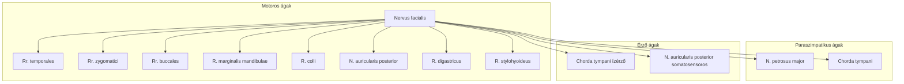

#részvizsga #neuroanat #agyidegek #facialis

# Részletes
**Bevezetés** A VII. agyideg, a nervus facialis (arcideg), egy rendkívül komplex, kevert ideg, amelynek elsődleges és legismertebb funkciója az arc mimikai izmainak motoros beidegzése, lehetővé téve az érzelmek kifejezését. Emellett azonban kritikus szerepet játszik az ízérzésben (a nyelv elülső kétharmadán), valamint a könny- és bizonyos nyálmirigyek (glandula submandibularis, glandula sublingualis, valamint az orr- és szájpadnyálkahártya kis mirigyei) paraszimpatikus beidegzésében is. Kis mértékben általános szenzoros rostokat is tartalmaz a fül környékéről. Sokrétű funkciója és bonyolult lefutása miatt sérülése változatos és gyakran súlyos klinikai tünetegyüttest eredményezhet.  

**Agyidegmagok (Nuclei nervi facialis)** A nervus facialis különböző funkcióihoz kapcsolódó neuroncsoportok az agytörzsben, specifikusan a hídban és a nyúltvelőben helyezkednek el.

- **Nucleus motorius nervi facialis:** Ez a speciális visceralis efferens (branchiomotoros) mag a híd alsó részének tegmentumában található. Az innen eredő motoros rostok egy jellegzetes, hurokszerű kanyarulatot (genu internum nervi facialis) írnak le a nervus abducens (VI.) magja körül, mielőtt ventrolateralisan kilépnének az agytörzsből a híd-nyúltvelő határon. Ez a mag felelős az arc összes mimikai izmának, a musculus platysmának (nyaki bőrizom), a musculus stylohyoideusnak, a musculus digastricus venter posteriorjának (kétfejű állkapocs alatti izom hátsó hasa), valamint a középfülben található musculus stapediusnak (kengyelizom) a beidegzéséért. A genu internum és a nervus abducens magjának topográfiai közelsége magyarázza, hogy bizonyos agytörzsi károsodások (pl. tumor, stroke) esetén a VI. és VII. agyideg funkciói együttesen károsodhatnak. A nucleus motorius nervi facialis felső részét (amely a homlok és szem körüli izmokat látja el) mindkét agyfélteke kérge beidegzi (bilaterális supranuclearis beidegzés), míg az alsó részét (amely az arc alsó felének izmait látja el) túlnyomórészt az ellenoldali agykéreg (kontralaterális supranuclearis beidegzés). Ez a differenciált beidegzés alapvető a centrális és perifériás facialis parézis elkülönítésében.  
    
- **Nucleus salivatorius superior:** Ez az általános visceralis efferens (paraszimpatikus) mag a híd tegmentumában, a motoros magtól dorsomedialisan helyezkedik el. Az innen eredő praeganglionaris paraszimpatikus rostok a nervus intermediuson keresztül hagyják el az agytörzset, majd a nervus petrosus majoron keresztül a ganglion pterygopalatinumhoz, illetve a chorda tympanin keresztül a ganglion submandibularéhoz futnak. Ezen dúcokban átkapcsolódva a postganglionaris rostok beidegzik a könnymirigyet (glandula lacrimalis), a glandula submandibularist és sublingualist, valamint az orr-, szájpad- és garatnyálkahártya apróbb mirigyeit. E mag működése tehát felelős a könny- és a fent említett nyálmirigyek szekréciójáért; sérülése a könnyelválasztás csökkenését (száraz szem, xerophthalmia) vagy a nyálelválasztás zavarát (szájszárazság, xerostomia) okozhatja.  
    
- **Nucleus tractus solitarii (pars gustatoria):** Ez a speciális visceralis afferens mag a nyúltvelő dorsalis részén található. Ide futnak be a nyelv elülső kétharmadáról és a lágy szájpad egy részéről származó ízérző információkat szállító rostok, amelyek a chorda tympanin és a nervus intermediuson keresztül érik el a magot. Fontos megjegyezni, hogy a nucleus tractus solitarii nemcsak a VII., hanem a IX. (nervus glossopharyngeus – nyelv hátsó harmadának ízérzése) és a X. (nervus vagus – epiglottis környékének ízérzése) agyidegek közös ízérző magjaként is funkcionál. Az ízérzés kiesése (ageusia vagy hypogeusia) a nyelv elülső kétharmadán fontos lokalizációs jel lehet a nervus facialis sérülésekor, különösen, ha a chorda tympani érintett.  
    

**Ganglion geniculi** A ganglion geniculi egy szenzoros dúc, amely a nervus facialis lefutása során, a sziklacsonton belüli facialis csatorna (canalis facialis) első éles kanyarulatában, a geniculum nervi facialisban ("térdecske") helyezkedik el. Ebben a dúcban találhatók a nervus intermediushoz tartozó pseudounipolaris érző neuronok sejttestjei, amelyek az ízérző információkat (a nyelv elülső kétharmadáról és a szájpad egy részéről) és az általános szomatikus érzéseket (a külső hallójárat egy kis területéről és a fülkagyló mögötti bőrről) közvetítik. A praeganglionaris paraszimpatikus rostok (a nervus petrosus majorhoz és a chorda tympanihoz) átfutnak a dúc mellett vagy azon keresztül anélkül, hogy átkapcsolódnának. A ganglion geniculi gyulladása vagy sérülése (pl. herpes zoster oticus, más néven Ramsay-Hunt szindróma, amelyet a Varicella-Zoster vírus reaktivációja okoz) jellegzetes és súlyos tünetegyüttest eredményezhet, amely magában foglalja a perifériás facialis parézist, heves fülfájdalmat, hólyagos kiütéseket a fülkagylón és a külső hallójáratban, ízérzészavart, halláscsökkenést és szédülést.  

**Lefutása** A nervus facialis motoros gyökere és a szenzoros/paraszimpatikus rostokat tartalmazó nervus intermedius (Wrisberg-féle ideg) az agytörzsből, a híd alsó széle és a nyúltvelő felső része közötti árokban, a cerebellopontin szögletben (kisagy-híd szöglet) lép ki, a nervus vestibulocochlearistól (VIII. agyideg) mediálisan és kissé előtte. A két komponens együtt lép be a belső hallójáratba (meatus acusticus internus), ahol a nervus vestibulocochlearissal közösen haladnak. A belső hallójárat mélyén a nervus facialis belép a sziklacsont állományában kanyargó, csontos facialis csatornába (canalis facialis Fallopii). Ennek a csatornának több szakasza van:  

1. **Labyrinthicus szakasz:** Rövid, a belső fül labyrinthusának képletei (csiga, íves járatok) között halad, itt található a ganglion geniculi.
2. **Tympanicus (dobüregi) szakasz:** Vízszintesen fut hátrafelé a dobüreg medialis fala mentén, az ovális ablak felett és a lateralis íves járat alatt.
3. **Mastoideus szakasz:** A dobüreg hátsó fala mögött függőlegesen lefelé kanyarodik a csecsnyúlvány (processus mastoideus) állományában. Végül a nervus facialis a foramen stylomastoideumon keresztül lép ki a koponyából. Ezt követően belép a fültőmirigy (glandula parotis) állományába, ahol legyezőszerűen öt főbb végágra oszlik (ez az ún. pes anserinus major – nagy lúdláb). Fontos kiemelni, hogy bár áthalad a mirigyen, annak állományát nem idegzi be motorosan vagy szenzorosan (a parotis paraszimpatikus beidegzését a nervus glossopharyngeus biztosítja). A nervus facialis hosszú és bonyolult intracranialis (koponyán belüli) és különösen intratemporalis (sziklacsonton belüli) lefutása miatt számos ponton sérülékeny. Károsíthatják tumorok (pl. acusticus neurinoma, parotis daganat), gyulladásos folyamatok (pl. középfülgyulladás, mastoiditis, vírusfertőzések), traumák (pl. sziklacsonttörés, arcon szerzett sérülések), valamint iatrogén ártalmak (pl. fülműtétek, parotis műtétek).  
    

**Fő Ágai (intratemporalis és extracranialis)** A nervus facialis a canalis facialisban és a koponyából való kilépése után adja le fontosabb ágait:

- **Nervus petrosus major (superficialis major):** A ganglion geniculiból ered, és a canalis facialis labyrinthicus szakaszának elülső nyílásán (hiatus canalis nervi petrosi majoris) lép ki a koponyaüreg középső koponyagödrébe. Praeganglionaris paraszimpatikus rostokat szállít a ganglion pterygopalatinumhoz (fossa pterygopalatina). Itt átkapcsolódva a postganglionaris rostok a nervus zygomaticuson és a nervus lacrimalison keresztül érik el a könnymirigyet, valamint közvetlenül beidegzik az orr-, szájpad- és garatnyálkahártya kis mirigyeit. Funkciója tehát a könnyelválasztás és a felső légúti nyálkahártya-mirigyek szekréciójának szabályozása.  
    
- **Nervus stapedius:** A canalis facialis tympanicus szakaszában, a pyramis eminentia pyramidalisánál válik le, és a középfül legkisebb harántcsíkolt izmát, a musculus stapediust idegzi be. Ennek az izomnak a kontrakciója (stapedius reflex) csillapítja a kengyel mozgását, ezáltal védi a belső fület a túl erős hangok károsító hatásától. A nervus stapedius bénulása a reflex kiesését és hyperacusist (a hangokra való kóros túlérzékenységet) eredményez.  
    
- **Chorda tympani:** A canalis facialis mastoideus szakaszának alsó részén ered, majd egy kis csontos csatornán (canaliculus chordae tympani) keresztül visszatér a dobüregbe. Áthalad a dobüregen a kalapács nyele és az üllő hosszú szára között, majd a fissura petrotympanicán (Glaser-rés) keresztül hagyja el a koponyát, és a fossa infratemporalisban csatlakozik a nervus lingualishoz (a nervus mandibularis V/3 ága). A chorda tympani kétféle rostot szállít:
    1. Speciális visceralis afferens (ízérző) rostokat a nyelv elülső kétharmadáról (a papillae fungiformes ízlelőbimbóiból).
    2. Praeganglionaris paraszimpatikus (secretomotoros) rostokat a ganglion submandibularéhoz, ahonnan a postganglionaris rostok a glandula submandibularist és sublingualist idegzik be, serkentve azok nyálelválasztását.  
        
- **Ramus auricularis posterior:** A foramen stylomastoideumon való kilépés után, vagy közvetlenül előtte eredő extracranialis ág. Motorosan beidegzi a fülkagyló mögötti kisebb izmokat (musculus auricularis posterior, musculus occipitalis) és szenzorosan ellát egy kis bőrterületet a fülkagyló mögött és a külső hallójárat bemeneténél.  
    
- **Ramus digastricus (et stylohyoideus):** Szintén extracranialis ág, a musculus digastricus venter posteriort és a musculus stylohyoideust idegzi be motorosan.  
    
- **Végágak az arcon (Pes anserinus major):** A fültőmirigy állományában a nervus facialis legyezőszerűen öt főbb ágcsoportra oszlik, amelyek az arc mimikai izmait látják el:
    - **Rami temporales:** A homlokizmokat (m. frontalis), a szem körüli izom felső részét (m. orbicularis oculi pars palpebralis et orbitalis superior) és a fülkagyló elülső izmait idegzik be.
    - **Rami zygomatici:** A szem körüli izom alsó részét (m. orbicularis oculi pars palpebralis et orbitalis inferior) és a járomcsontról eredő mimikai izmokat (pl. mm. zygomatici major et minor) látják el.
    - **Rami buccales:** A pofa izmait (m. buccinator), a száj körüli izmok felső részét (m. orbicularis oris pars superior, m. levator labii superioris, m. levator anguli oris) idegzik be.
    - **Ramus marginalis mandibulae:** Az alsó ajak és az áll izmait (m. depressor labii inferioris, m. depressor anguli oris, m. mentalis) látja el. Sérülése esetén az alsó ajak mozgása az érintett oldalon gyengül, a szájzug lefelé és kifelé deviálhat.
    - **Ramus colli:** A nyaki bőrizmot, a platysmát idegzi be.  
        

**Ellátási Területek Összefoglalása**

- **Motoros:** Az arc összes mimikai izma, musculus platysma, musculus stylohyoideus, musculus digastricus venter posterior, musculus stapedius.  
    
- **Paraszimpatikus (secretomotoros):** Könnymirigy (glandula lacrimalis), állkapocs alatti nyálmirigy (glandula submandibularis), nyelv alatti nyálmirigy (glandula sublingualis), valamint az orr-, szájpad- és garatnyálkahártya kis mirigyei.  
    
- **Szenzoros (speciális visceralis afferens – ízérzés):** A nyelv elülső kétharmada és a lágy szájpad egy része.  
    
- **Szenzoros (általános somaticus afferens – tapintás, fájdalom, hő):** Egy kis bőrterület a külső hallójáratban, a fülkagylón és a fülkagyló mögött.  
    

**Klinikai Vonatkozások** A nervus facialis károsodása a lézió helyétől és kiterjedésétől függően változatos tüneteket okozhat. A leggyakoribb és leglátványosabb tünet az arcizmok bénulása (facialis parézis). Két fő típusa van:

- **Centrális facialis parézis:** A supranuclearis pálya (tractus corticobulbaris) sérülése következtében alakul ki, leggyakrabban agyi stroke miatt. Mivel a nervus facialis motoros magjának a homlokot és a szem körüli izmokat beidegző felső része kétoldali (bilaterális) kérgi beidegzést kap, míg az arc alsó felének izmait ellátó alsó magrészlet túlnyomórészt csak az ellenoldali (kontralaterális) agykéregből, ezért centrális parézis esetén jellemzően csak az ellenoldali alsó arcfél bénul meg. Ez azt jelenti, hogy a beteg a sérüléssel ellentétes oldalon a szájzugát nem tudja megfelelően mozgatni (az legörbül), a nasolabialis redő elsimul, de a homlokráncolás és a szemzárás képessége általában megtartott vagy csak enyhén gyengült. Az emocionális mimika (pl. spontán mosoly) gyakran megmarad, ellentétben az akaratlagos mozgásokkal.  
    
- **Perifériás facialis parézis:** A nervus facialis motoros magjának vagy az ideg perifériás szakaszának (az agytörzsi kilépéstől a végelágazódásokig) károsodása okozza. Gyakori oka az idiopathiás Bell-féle bénulás (valószínűleg vírusos eredetű), de okozhatja trauma, tumor, gyulladás is. Perifériás parézis esetén az azonos oldali teljes arcfél mimikai izmai megbénulnak. A klinikai kép jellegzetes: a homlokráncolás az érintett oldalon elmarad, a szemrés tágabb, a szem zárása nehezített vagy lehetetlen (lagophthalmus). Szemzárási kísérletnél a szemgolyó felfelé és kifelé fordul, láthatóvá téve a fehér ínhártyát (Bell-tünet). A szájzug az ép oldal felé húzódik, az érintett oldalon legörbül, a nasolabialis redő elsimul. A beteg nem tud fütyülni, felfújni a pofazacskóját, és a folyadék kicsoroghat a szája sarkából. A lézió pontos helyétől (magasságától) függően a perifériás arcbénulást kísérheti ízérzészavar a nyelv elülső kétharmadán (ha a chorda tympani sérül a foramen stylomastoideum felett), hyperacusis (ha a nervus stapedius sérül), csökkent könnyelválasztás (ha a nervus petrosus major sérül a ganglion geniculi környékén vagy afelett), valamint csökkent nyálelválasztás. A nervus facialis bonyolult intratemporalis lefutása és a sziklacsonton belüli szűk csatorna (canalis facialis) különösen sérülékennyé teszi az ideget gyulladások (pl. vírusfertőzés, középfülgyulladás), traumák (pl. sziklacsonttörés) vagy tumorok (pl. acusticus neurinoma kompressziója) esetén. A tünetek (arcbénulás, ízérzészavar, hyperacusis, könnye-/nyálelválasztási zavar) kombinációja pontosan utalhat a sérülés helyére a csatornán belül, ami prognosztikai és terápiás jelentőséggel bír. Például, ha a sérülés a nervus petrosus major eredése előtt van, minden funkció kiesik. Ha utána, de a nervus stapedius előtt, akkor a könnyelválasztás megmarad, de hyperacusis lesz, stb. Tehát a klinikai tünetegyüttes segít a lézió pontosabb lokalizálásában a csatornán belül, ami prognosztikai és terápiás jelentőséggel bír. A chorda tympani nemcsak ízérző és paraszimpatikus rostokat szállít, hanem anatómiai közelsége a középfül képleteihez (áthalad a dobüregen a malleus és incus között) magyarázza, hogy középfülgyulladások vagy műtétek során miért sérülhet, ízérzészavart és nyálelválasztási problémákat okozva az arcbénuláson túl vagy anélkül.  
    

A centrális és perifériás facialis parézis elkülönítése alapvető neurológiai diagnosztikai feladat, és a nervus facialis motoros magjának differenciált supranuclearis beidegzési sajátosságain alapul. Az arc felső részét (homlok, szem körüli izmok) beidegző neuroncsoportok kétoldali, míg az arc alsó részét (száj körüli izmok) beidegzők főként ellenoldali kérgi inputot kapnak. Ez a "biztonsági" beidegzés a felső arcfél számára evolúciósan fontos lehetett (pl. szemvédelem).

**Táblázat 2: A Nervus Facialis (VII.) Főbb Jellemzői**

| Jellemző                                         | Leírás                                                                                                                                                                                                                                                                                                                                      |
| :----------------------------------------------- | :------------------------------------------------------------------------------------------------------------------------------------------------------------------------------------------------------------------------------------------------------------------------------------------------------------------------------------------ |
| **Agyidegmagok**                                 | Nucleus motorius n. facialis (motoros), Nucleus salivatorius superior (paraszimpatikus), Nucleus tractus solitarii (ízérző)                                                                                                                                                                                                                 |
| **Fő Funkciók**                                  | Motoros: mimikai izmok, m. stapedius. Paraszimpatikus: könnymirigy, gl. submandibularis, gl. sublingualis, orr- és szájpadmirigyek. Ízérző: nyelv elülső 2/3. Általános szenzoros: kis fülkörüli terület.                                                                                                                                   |
| **Koponyalapi Kilépés/Fontos Áthaladási Pontok** | Belső hallójárat (meatus acusticus internus), Canalis facialis (benne: ganglion geniculi), Foramen stylomastoideum, Glandula parotis (pes anserinus)                                                                                                                                                                                        |
| **Főbb Ágak és Funkcióik**                       | **N. petrosus major:** könnymirigy, orr- és szájpadmirigyek (paraszimp.). **N. stapedius:** m. stapedius (motoros). **Chorda tympani:** ízérzés (nyelv elülső 2/3), gl. submandibularis/sublingualis (paraszimp.). **Pes anserinus:** mimikai izmok (motoros).                                                                              |
| **Sérülés Főbb Klinikai Tünetei**                | **Perifériás parézis:** Azonos oldali teljes arcfélbénulás (homlokráncolás, szemzárás, szájmozgás zavara), Bell-tünet. Kísérheti: ízérzészavar, hyperacusis, könny-/nyálelválasztási zavar (lézió magasságától függően). **Centrális parézis:** Ellenoldali alsó arcfélbénulás (szájzúg), homlokráncolás és szemzárás általában megtartott. |

# Összefoglalás
## 🧠 Nucleus nervi facialis

### 📍 Elhelyezkedés

- A **formatio reticularis** caudalis részén található
    
- A **pons ventrolateralis** területén
    
- **Agytörzsi metszeten**: a sulcus limitans (motoros-szenzoros elválasztó) medialisan
    

### 🧭 Funkció

- A **nervus facialis (VII. agyideg)** somatomotoros magja
    
- **Mimikai izmokat** idegzi be (pl. frontalis, orbicularis oris/oculi, zygomaticus, buccinator, platysma stb.)
    

### 🧬 Rosttípus

- **Somatomotoros (SE - specialis efferens)**
    

### 🔄 Lefutása

1. **Afferens rostokat** kap a motoros kéregből a corticobulbaris pályán keresztül
    
2. A **kilépő idegrostok** **hajlított pályán** (genu) haladnak:
    
    - **Belülről megkerülik a nucleus nervi abducentist (VI)** (→ „**belkanyarodás**”)
        
3. Az agytörzsből **a nyúltagy-híd határán** lép ki, **angulus pontocerebellaris** régióban
    

### 🤕 Klinikai jelentőség

#### Felső és alsó motoneuron laesió megkülönböztetése:

- **Felső motoneuron laesio** (centralis paresis):
    
    - Az arc **alsó felének ellenoldali** bénulása
        
    - Az arc **felső felét megkíméli** (kétoldali corticalis beidegzés miatt)
        
- **Alsó motoneuron laesio** (peripheriás paresis, pl. Bell-paresis):
    
    - Az arc **teljes féloldali** bénulása
- 

# Ábrák, diagrammok
##

### 📌 Megjegyzések a rosttípusokról

- **Motoros (SVE)**: A mimikai izmokat, a stapedius izmot, a digastricus hátsó hasát és a stylohyoideus izmot idegzi be.
    
- **Paraszimpatikus (GVE)**: A könny-, orr-, szájpad-, submandibularis és sublingualis mirigyeket látja el.
    
- **Érző (GSA/GVA)**: A külső hallójárat és a fülkagyló bőrének érzékelése, valamint az ízérzés az elülső kétharmad nyelvről.
-

![[Nervus_facialis.webp]]
[[Bell Paresis]]