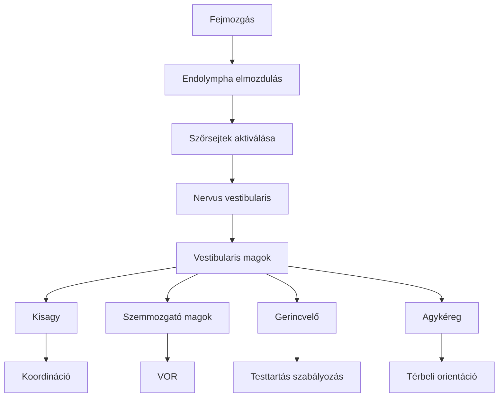

#részvizsga #neuroanat #vestibular

# Részletes
**Bevezetés** A vestibularis rendszer, más
néven egyensúlyozó szervrendszer, alapvető szerepet játszik a test egyensúlyának fenntartásában, a térbeli orientációban, valamint a fej és a test mozgásainak (mind a lineáris, mind a szöggyorsulásnak) érzékelésében. Ezen túlmenően kritikus fontosságú a tekintet stabilizálásában a fejmozgások során, amit a vestibulo-ocularis reflex (VOR) biztosít. Ezen funkciók bármilyen zavara jelentős életminőség-romlást, szédülést és instabilitást eredményezhet.  

**Perifériás Vestibularis Szervek (a belső fül labyrinthusában)** A perifériás vestibularis szervek a belső fül csontos labyrinthusában elhelyezkedő hártyás labyrinthus részei, és két fő komponensből állnak: az íves járatokból és az otolith szervekből.

- **Íves járatok (canales semicirculares):** Három, egymásra közel merőleges síkban (anterior vagy superior, posterior és horizontalis vagy lateralis) elhelyezkedő, folyadékkal (endolympha) telt csőrendszer. Mindegyik íves járatnak az egyik végén egy tágulat, az **ampulla** található. Az ampullában helyezkedik el a **crista ampullaris**, amely a tulajdonképpeni érzékszerv. A crista ampullaris érzékelő sejtjei a **szőrsejtek**, amelyeknek sztereociliumai és egy hosszabb kinociliuma egy kocsonyás, kupolaszerű anyagba, a **cupulába** nyúlnak, amely az ampulla teljes keresztmetszetét kitölti. A fej forgó mozgásai (szöggyorsulás) során az endolympha tehetetlensége miatt relatíve elmozdul a csatorna falához képest, és ez az áramlás elhajlítja a cupulát, ingerületbe hozva ezzel a szőrsejteket. A három íves járat síkjainak elrendeződése teszi lehetővé a fej bármilyen irányú forgásának háromdimenziós érzékelését.  
    
- **Otolith szervek (tömlőcske – utriculus, és zsákocska – sacculus):** Az utriculus és a sacculus a hártyás labyrinthus két, egymással összeköttetésben álló ürege, amelyekben szintén érzékhámfoltok, az ún. **maculák** (macula utriculi és macula sacculi) találhatók. A maculák szőrsejtjeinek ciliumai egy kocsonyás **otolith membránba** ágyazódnak, amelynek felszínén apró kalcium-karbonát kristályok, az **otoconiumok** (más néven statoconiumok vagy otolithok) helyezkednek el. Az otolith szervek a lineáris gyorsulást (pl. előre-hátra, fel-le, oldalirányú mozgások) és a fej statikus helyzetét a gravitációs térhez képest (dőlés) érzékelik. A lineáris gyorsulás vagy a fej helyzetének megváltozása során az otoconiumok nagyobb sűrűségük és tehetetlenségük miatt elmozdítják az otolith membránt a szőrsejtekhez képest, ingerületbe hozva azokat.  
    
- **Szőrsejtek (receptorsejtek):** Mind az íves járatokban, mind az otolith szervekben ezek a specializált mechanoreceptor sejtek végzik az ingerátalakítást. A szőrsejtek apikális felszínén sztereociliumok és egy kinocilium található. Ha a sztereociliumok a kinocilium irányába hajlanak el, a sejt depolarizálódik (ingerületbe jön), és fokozódik a neurotranszmitter (valószínűleg glutamát) felszabadulása a bazális végződéseknél, ahol a vestibularis ideg afferens rostjaival szinaptizálnak. Ha az elhajlás a kinociliummal ellentétes irányú, a sejt hyperpolarizálódik, és csökken a neurotranszmitter-felszabadulás.  
    

**Centrális Vestibularis Rendszer** A perifériás receptorokból származó információkat a centrális vestibularis rendszer dolgozza fel és integrálja.

- **Nervus vestibularis (a VIII. agyideg, nervus vestibulocochlearis része):** A perifériás vestibularis szőrsejtektől származó idegi információt továbbítja az agytörzs felé. Az elsődleges afferens neuronok bipoláris idegsejtek, amelyeknek sejttestjei a belső hallójáratban elhelyezkedő **ganglion vestibularéban (Scarpa-dúc)** találhatók.  
    
- **Vestibularis magok:** A nervus vestibularis rostjainak többsége a híd alsó részén és a nyúltvelő felső részén, a IV. agykamra alapjánál elhelyezkedő négy fő vestibularis magcsoportban végződik: **nucleus vestibularis superior (Bechterew-mag)**, **nucleus vestibularis lateralis (Deiters-mag)**, **nucleus vestibularis medialis (Schwalbe-mag)** és **nucleus vestibularis inferior (Roller-mag)**. Ezek a magok nemcsak a primer vestibularis afferenseket fogadják, hanem jelentős inputot kapnak a kisagyból, a látórendszerből és a szomatoszenzoros rendszerből is, így központi integrációs szerepet töltenek be az egyensúlyi információk feldolgozásában.  
    
- **Pályák a vestibularis magokból:** A vestibularis magokból számos fontos efferens pálya indul ki, amelyek az egyensúly fenntartásában és a mozgáskoordinációban játszanak szerepet:
    - **Kisagy (cerebellum):** Különösen az archicerebellumhoz (flocculonodularis lebeny és vermis) futnak kétirányú, reciprok kapcsolatok. A kisagy finomhangolja a testtartási reflexeket és a mozgásokat a vestibularis információk alapján.  
        
    - **Szemmozgató magok (III., IV., VI. agyidegek magjai):** A vestibularis magokból (főként a superior és medialis magokból) rostok futnak a **fasciculus longitudinalis medialison (FLM)** keresztül a szemmozgató idegek motoros magjaihoz. Ez a pálya alapvető a **vestibulo-ocularis reflex (VOR)** működéséhez, amely a tekintet stabilizálásáért felelős a fejmozgások során.  
        
    - **Gerincvelő:** Két fő leszálló pálya: a **tractus vestibulospinalis lateralis** (főként a Deiters-magból ered, és az azonos oldali gerincvelői motoneuronokra hatva fokozza az antigravitációs (extensor) izmok tónusát, hozzájárulva a testtartás fenntartásához) és a **tractus vestibulospinalis medialis** (főként a medialis magból ered, a fasciculus longitudinalis medialis részeként száll le a nyaki gerincvelőhöz, és a fej- és nyakizmok koordinációjában, valamint a fej helyzetének stabilizálásában játszik szerepet).  
        
    - **Agykéreg:** A vestibularis információk a thalamuson (valószínűleg a nucleus ventralis posterior (VP) és a nucleus ventralis lateralis (VL) magcsoportokon) keresztül eljutnak az agykéreg több területére is, beleértve a parieto-insularis vestibularis cortexet (PIVC), amely a temporalis és parietalis lebeny határán található. Ezek a kérgi területek felelősek a térbeli orientáció, a mozgás és a testhelyzet tudatos érzékeléséért.  
        
    - **Autonóm idegrendszeri központok:** A vestibularis magok kapcsolatban állnak az agytörzsi autonóm központokkal, mint például a nucleus tractus solitarii és a formatio reticularis. Ez magyarázza a vestibularis rendszer erős ingerlésekor (pl. tengeribetegség, Meniére-roham) gyakran fellépő vegetatív tüneteket, mint a hányinger, hányás, sápadtság és verejtékezés. A vestibularis rendszer nem izoláltan működik, hanem szorosan integrálódik a látórendszerrel és a proprioceptív rendszerrel. E három rendszer összhangja alapvető a stabil testtartáshoz és a térbeli tájékozódáshoz. Bármelyik rendszer zavara vagy a köztük lévő információ-feldolgozás hibája egyensúlyzavarhoz és szédüléshez vezethet, még akkor is, ha a vestibularis végkészülék ép.  
        

**Az Egyensúlyérzékelés Élettana** A fej bármilyen irányú mozgása vagy helyzetváltozása az íves járatokban és az otolith szervekben található szőrsejtek specifikus ingerlési mintázatát váltja ki. Az endolympha áramlása az íves járatokban a szöggyorsulást, míg az otolithok elmozdulása a lineáris gyorsulást és a fej statikus dőlését kódolja. Ezeket az információkat a nervus vestibularis továbbítja az agytörzsi vestibularis magokhoz. Itt történik az elsődleges feldolgozás és integráció más szenzoros modalitásokból (látás, propriocepció) származó információkkal. Ennek eredményeként komplex reflexválaszok generálódnak a szemizmokban (tekintetstabilizálás), a nyak- és törzsizmokban (fej- és testtartás korrekciója), valamint a végtagizmokban (egyensúly fenntartása).

**Vestibulo-ocularis reflex (VOR)** A VOR egy kritikus fontosságú reflex, amely biztosítja a tiszta látást a fejmozgások közben. A fej bármilyen irányú elmozdulásakor a VOR a fej mozgásával ellentétes irányú, de azonos sebességű és amplitúdójú kompenzáló szemmozgásokat generál. Ezáltal a tekintet egy fix ponton marad a környezetben, függetlenül a fej mozgásától. A VOR egy rendkívül gyors, jellemzően három neuronból álló reflexív: az első neuron a ganglion vestibularéban található, a második a vestibularis magokban, a harmadik pedig a szemmozgató agyidegek (III., IV., VI.) magjaiban. A VOR plaszticitással és adaptációs képességgel rendelkezik; sérülése esetén a központi idegrendszer, főleg a kisagy, képes részben kompenzálni a funkciókiesést, különösen célzott vestibularis rehabilitációs tréninggel.  

**Klinikai Vonatkozások** A vestibularis rendszer károsodása jellegzetes tüneteket okoz, amelyek közül a legfontosabbak a vertigo (forgó jellegű szédülés), a nystagmus (akaratlan, ritmikus szemmozgások), az egyensúlyzavar (ataxia, dőlés, instabil járás), valamint a hányinger és hányás. A tünetek jellege, például a nystagmus iránya és tulajdonságai (pl. fixációra gátlódik-e), segíthet a károsodás helyének (perifériás – belső fül vagy vestibularis ideg; vagy centrális – agytörzs, kisagy) meghatározásában.  

**Táblázat 3: A Vestibularis Rendszer Komponensei és Funkciói**

|Komponens|Érzékelt Inger / Fő Funkció|Fontosabb Kapcsolatok|Klinikai Jelentőség (sérülés esetén)|
|:--|:--|:--|:--|
|**Íves járatok (Canales semicirculares)**|Szöggyorsulás (fej forgó mozgásai)|Vestibularis magok|Vertigo, nystagmus, egyensúlyzavar (pl. BPPV egyik formája, neuritis vestibularis)|
|**Otolith szervek (Utriculus, Sacculus)**|Lineáris gyorsulás, fej statikus helyzete (gravitáció)|Vestibularis magok|Vertigo, dőlésérzés, egyensúlyzavar (pl. BPPV másik formája, otolith diszfunkció)|
|**Nervus vestibularis (VIII. agyideg része)**|Vestibularis információk továbbítása a perifériáról a központba|Ganglion vestibulare, Vestibularis magok|Perifériás vertigo, nystagmus, egyensúlyzavar (pl. neuritis vestibularis, acusticus neurinoma)|
|**Vestibularis magok (agytörzs)**|Vestibularis, látási, proprioceptív információk integrálása, reflexek generálása|Kisagy, Szemmozgató magok (FLM), Gerincvelő (tractus vestibulospinales), Agykéreg (thalamuson át), Autonóm központok|Centrális vertigo/dizziness, nystagmus (gyakran atípusos), ataxia, vegetatív tünetek (pl. agytörzsi stroke, SM)|
|**Vestibulo-ocularis reflex (VOR)**|Tekintet stabilizálása fejmozgások során|Íves járatok -> Vestibularis magok -> FLM -> Szemmozgató magok -> Szemizmok|Oscillopsia (környezet látszólagos ugrálása fejmozgáskor), homályos látás mozgás közben, szédülés|
|**Tractus vestibulospinales**|Testtartás, egyensúly fenntartása, extensor tónus szabályozása, fej-nyak koordináció|Vestibularis magok -> Gerincvelői motoneuronok|Testtartási instabilitás, dőlési hajlam, járászavar|
|**Kisagy (főként archicerebellum)**|Mozgáskoordináció finomhangolása, VOR adaptációja, testtartási reflexek modulálása|Reciprok kapcsolatok a vestibularis magokkal|Ataxia, dysmetria, intenciós tremor, nystagmus, VOR adaptáció zavara|

# Összefoglalás
A vestibularis rendszer a test egyensúlyáért, a térbeli orientációért és a fej mozgásainak érzékeléséért felelős komplex hálózat.

---

### **👂 1. A Perifériás Rész (Belső Fül)**

A belső fül csontos labirintusában található.

#### **🔄 Íves járatok (Canales Semicirculares)**

- **Feladat:** A fej forgó mozgásainak (szöggyorsulás) érzékelése.
- **Felépítés:** 3, egymásra merőleges, folyadékkal (endolympha) telt cső.
- **Működés:**
    1. **Fejforgás** 💃 → Az endolympha tehetetlensége miatt "lemarad".
    2. Az endolympha-áramlás elhajlítja a kocsonyás **cupulát**.
    3. A cupulában lévő **szőrsejtek** ingerületbe jönnek.

#### **🚦 Otolith Szervek (Utriculus & Sacculus)**

- **Feladat:** A lineáris gyorsulás (pl. lift, autó) és a fej gravitációs helyzetének (dőlés) érzékelése.
- **Felépítés:** Érzékhámfoltjaik (maculák) egy kocsonyás membránba ágyazódnak, melyen apró kalcium-karbonát kristályok, ún. **otoconiumok** (kristályok 💎) ülnek.
- **Működés:**
    1. **Gyorsulás/Dőlés** 🚗/ tilting → A nehezebb otoconiumok elmozdítják a membránt.
    2. A membrán elmozdulása elhajlítja a **szőrsejteket**, ingerületet keltve.

#### **🔬 Szőrsejtek: A Rendszer Receptorai**

- **Kulcsszereplők:** Sztereociliumok (sörték) és egy kinocilium (a "király" cilium 👑).
- **Ingerület:** Ha a sörték a "király" felé hajlanak → **Depolarizáció (ingerület)** 🔥.
- **Gátlás:** Ha a sörték a "királytól" elhajlanak → **Hyperpolarizáció (gátlás)** 🧊.

---

### **🧩 2. A Centrális Rész (Agy)**

Az agy dolgozza fel a perifériáról érkező jeleket.

#### **⚡ Nervus Vestibularis (VIII. agyideg része)**

- **Feladat:** Információt szállít a szőrsejtektől az agytörzsbe.
- **Központja:** A neuronok sejttestjei a **Ganglion Vestibulare-ban** (Scarpa-dúc) vannak.

#### **🖥️ Vestibularis Magok (Az Integrációs Központ)**

- **Elhelyezkedés:** A híd és a nyúltvelő határán.
- **Feladat:** A vestibularis, látási (👁️) és proprioceptív (🦵) információk központi integrálása.
- **A 4 fő mag:**
    - **Superior** (Bechterew)
    - **Lateralis** (Deiters)
    - **Medialis** (Schwalbe)
    - **Inferior** (Roller)

#### **🚀 Főbb Kimeneti Pályák a Magokból**

- **🎯 Kisagy (Cerebellum):** Finomhangolja a mozgást és a testtartási reflexeket. Kétirányú a kapcsolat.
- **👀 Szemmozgató Magok (III, IV, VI. agyideg):** A **Fasciculus Longitudinalis Medialis (FLM)** nevű pályán keresztül. Ez a **VOR** alapja.
- **💪 Gerincvelő:**
    - `Tractus Vestibulospinalis Lateralis`: Szabályozza az antigravitációs (extensor) izmokat a testtartáshoz 🧍.
    - `Tractus Vestibulospinalis Medialis`: Koordinálja a fej és a nyak mozgását 🦒.
- **🗺️ Agykéreg:** A thalamuson keresztül jut el az infó, tudatosítva a térbeli helyzetet és a mozgást (főleg a PIVC területre).
- **🤢 Autonóm Központok:** Kapcsolatban áll a hányingerért, hányásért felelős agytörzsi területekkel. Ezért van tengeribetegség!.

---

### **⚙️ A Vestibulo-Ocularis Reflex (VOR)**

- **Cél:** A tekintet stabilizálása a fej mozgása közben, hogy a látás éles maradjon.
- **Működés:** A fej mozgásával **ellentétes irányú**, de azonos sebességű szemmozgást hoz létre.
    - Fej jobbra ➡️ = Szemek balra ⬅️
- **Reflexív:** Rendkívül gyors, 3 neuronos pálya (Receptor → Agytörzs → Szemizmok).
- **Klinikai jel:** Sérülésekor a beteg `oscillopsiá`-t tapasztal (a környezet látszólag ugrál fejmozgáskor).

---

### **🩺 Klinikai Vonatkozások**

A rendszer károsodása jellegzetes tüneteket okoz.

- **😵 Vertigo:** Forgó jellegű szédülés.
- **👀 Nystagmus:** Akaratlan, ritmikus szemmozgások. A nystagmus iránya és jellege segít elkülöníteni a **perifériás** (belső fül) és a **centrális** (agy) eredetű problémát.
- ** unsteady Ataxia:** Egyensúlyzavar, instabil járás, dőlés.
- **🤮 Vegetatív tünetek:** Hányinger, hányás, sápadtság.

---

## Vestibularis rendszer – összefoglaló

### 🧠 Alapfunkciók

- Egyensúly, térbeli orientáció, fej-test mozgás érzékelés (lineáris & szöggyorsulás).
    
- Tekintet stabilizálása (→ [[Vestibulo-ocularis reflex|VOR]]).
    
- Zavar esetén: szédülés, instabilitás, vegetatív tünetek.
    

---

### 👂 Perifériás vestibularis szervek

#### 1. Íves járatok (canales semicirculares)

- Három síkban: anterior, posterior, horizontalis.
    
- Szöggyorsulás érzékelése.
    
- Crista ampullaris → szőrsejtek + Cupula → endolympha áramlás ingerli.
    

#### 2. Otolith szervek: Utriculus& Sacculus

- Lineáris gyorsulás és fej statikus helyzete.
    
- Maculae+ otolith membrán + Otoconiumok
    
- Gravitáció/gyorsulás → szőrsejtek elhajlása.
    

#### 3. Szőrsejtek

- Sztereociliumok + kinocilium.
    
- Kinocilium felé hajlás → depolarizáció (ingerület).
    
- Ellentétes irány → hyperpolarizáció (gátlás).
    

---

### 🧩 Centrális vestibularis rendszer

#### 1. Nervus vestibularis(VIII. agyideg része)

- Ganglion vestibulare → bipoláris neuronok.
    
- Szőrsejtekből → vestibularis magokhoz.
    

#### 2. Vestibularis magok(4 fő)

- Superior (Bechterew), Lateralis (Deiters), Medialis (Schwalbe), Inferior (Roller).
    
- Integráció: látás, propriocepció, kisagy.
    

#### 3. Lefutó & kapcsolódó pályák

- → Kisagy (archicerebellum): testtartás, VOR finomhangolása.
    
- → Szemmozgató magok (III, IV, VI) → FLM: VOR
    
- → Gerincvelő:
    
    - Tractus vestibulospinalis lateralis → testtartás (extensor tónus).
        
    - Tractus vestibulospinalis medialis → fej-nyak koordináció.
        
- → Agykéreg: PIVC (temporalis/parietalis határ).
    
- → Autonóm központok: hányinger, hányás, sápadtság.
    

---

### ⚙️ Vestibulo-ocularis reflex (VOR)

- Tekintet stabilizálása fejmozgáskor.
    
- Három neuronból álló reflexív.
    
- Fejmozgással ellentétes irányú szemmozgás.
    
- Kisagy képes adaptálni (rehabilitáció!).
    

---

### 🧪 Klinikai vonatkozások

- Tünetek: vertigo, nystagmus, ataxia, hányinger.
    
- Diagnosztika: nystagmus jellege → centrális vs perifériás károsodás.
    

---

### 📊 Táblázat – Vestibularis rendszer komponensei

|Komponens|Funkció|Kapcsolatok|Sérülés tünetei|
|---|---|---|---|
|Íves járatok|Szöggyorsulás|Vestibularis magok|Vertigo, nystagmus, BPPV, neuritis vestibularis|
|Otolith szervek|Lineáris gyorsulás, gravitáció|Vestibularis magok|Dőlés, vertigo, otolith diszfunkció|
|Nervus vestibularis|Info továbbítása (periféria → központ)|Ganglion vestibulare, magok|Perifériás szédülés, neuritis, acusticus neurinoma|
|Vestibularis magok|Szenzoros integráció, reflexgenerálás|Kisagy, FLM, gerincvelő, agykéreg|Centrális szédülés, ataxia, vegetatív tünetek|
|VOR|Tekintet stabilizálása fejmozgás alatt|Íves járatok → FLM → szemmozgató magok|Oscillopsia, homályos látás, szédülés|
|Tractus vestibulospinales|Testtartás, extensor tónus, nyakmozgás|Vestibularis magok → gerincvelő|Instabilitás, dőlés, járászavar|
|Kisagy (archicerebellum)|Mozgáskoordináció, reflex finomhangolás|Reciprok kapcsolatok|Ataxia, nystagmus, tremor, VOR zavar|

---

# Ábrák, diagrammok

![[Pasted image 20250510203924.jpg]]
![[Pasted image 20250510203935.png]]![[Pasted image 20250510204026.jpg]]
# Linkek
[Kenhub](https://www.kenhub.com/en/library/anatomy/the-vestibular-system)
[Physiopedia ](https://www.physio-pedia.com/Vestibular_System?utm_source=chatgpt.com)[
[Cleveland clinic](https://my.clevelandclinic.org/health/body/vestibular-system?utm_source=chatgpt.com)